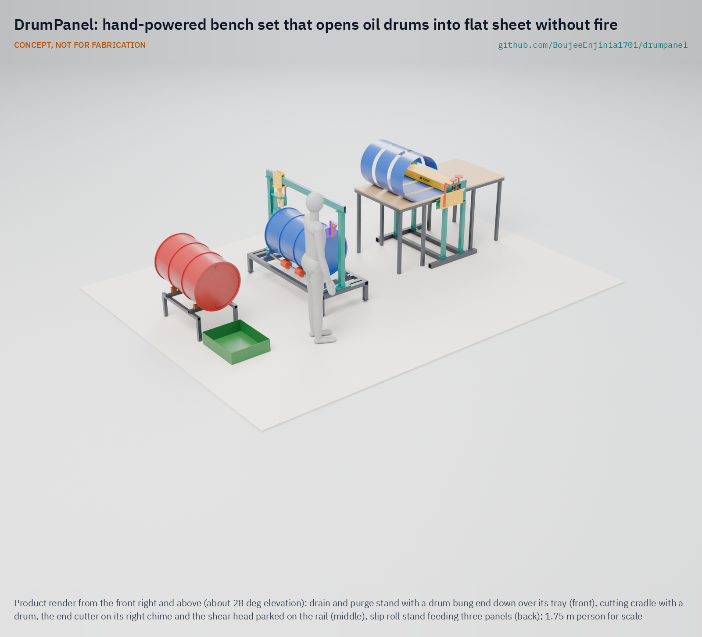
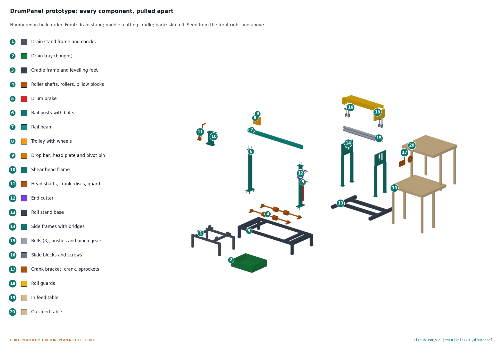

# DrumPanel

   

**Area:** Circular materials · **TRL:** 3 of 9 (proof of concept on paper) · **Value-engineering target:** USD 3,000 (estimated cost USD 2,794) · **Difficulty:** 3 of 5

Turns empty oil drums into flat sheet by purging and cold-opening them instead of burning them.

## Concept rationale

Used 55 gallon (about 208 L) steel drums are a cheap source of sheet metal for artisans; accounts from Haiti speak of three sheets of about 18 by 72 in (460 by 1,830 mm) per drum. DrumPanel gets three flat panels about 233 x 1,800 mm and two head discs about 552 mm across from each drum. Today the common method is to fill the drum with dried leaves and set it on fire to clear paint and residue, then chisel off the ends, split the side and flatten it. DrumPanel keeps the craft and changes the first steps: purge the drum, check it for vapour, cut it cold and roll it flat with hand-cranked tools on a bench.

The design is manual on purpose. The preliminary IP screen found powered drum cutter-flatteners on the market; DrumPanel assumes workshops with little money and no dependable power. A bench set built from commodity steel and bearings, published openly with a written purge and vapour check, can be made by a local fabricator for an estimated USD 2,794 (value-engineering target USD 3,000) and shared across a workshop cluster.

## Burning platform

In Croix-des-Bouquets, Haiti, the centre of Haitian metal sculpture since Georges Liautaud began the form in the 1950s, drum lids are cut open with a chisel and hammer, the side is split, and the interior is filled with dried sugarcane or grass and set on fire to remove grime before the drum is flattened ([SFO Museum](https://www.sfomuseum.org/exhibitions/haitian-metal-sculpture)). Other accounts describe stuffing drums with banana leaves to burn off paint and residue, and cutting with only hammers and chisels ([Singing Rooster](https://singingrooster.org/about-haitian-art/)). Artists then flatten the body by climbing inside and using their weight to open it up ([Roots of Development](https://store.rootsofdevelopment.org/wp-content/uploads/2023/12/About-Haitian-Metal-Art.pdf)).

This first stage is where newcomers begin: new artists usually start by burning out whole 55 gallon drums, cutting them down and pounding the surfaces flat ([Global Exchange](https://globalexchange.org/tag/haiti-oil-drum-art/)). The work is loud enough that a support group tried supplying ear plugs ([Singing Rooster](https://singingrooster.org/about-haitian-art/)). The raw material is plentiful, a byproduct of shipping through the harbour in Port-au-Prince ([Haiti Hub](https://haitihub.com/the-story-of-haitian-metal-art/)), so better tools for this stage would reach many workshops.

## Where it could be used

### By industry

| Industry | Use |
| --- | --- |
| Artisan metalwork and crafts | Opening and flattening drums into sheet for sculpture, wall art and homewares |
| Informal fabrication | Sheet for stoves, boxes, roofing patches and small tanks in workshops without sheet stock |
| Drum reconditioning and recycling | Cold, manual opening of drums that cannot be reused whole |
| Vocational training | A documented, safer drum preparation method for apprentices |
| Fair trade and export buyers | A cleaner, repeatable supply chain for drum-based products |

### By country or region

| Country or region | Why it matters there |
| --- | --- |
| Haiti, Croix-des-Bouquets | Noailles in Croix-des-Bouquets has long been the centre of Haitian metal art, though gang violence has recently forced artists to relocate ([SFO Museum](https://www.sfomuseum.org/exhibitions/haitian-metal-sculpture)). |
| Haiti, Port-au-Prince | Drums come to artisans as a byproduct of shipping through the harbour, and each 55 gallon drum yields three sheets of about 18 by 72 in ([Haiti Hub](https://haitihub.com/the-story-of-haitian-metal-art/)). |
| United States | Fair trade stores sell Haitian oil drum art, giving artisans who export under fair labour conditions a route out of poverty ([Global Exchange](https://globalexchange.org/tag/haiti-oil-drum-art/)). |
| Europe and North America | Croix-des-Bouquets sculpture made with hacksaws, hammers and chisels is shown in galleries, museums and private collections ([Nader Haitian Art](https://www.naderhaitianart.com/blogs/news/a-deep-dive-into-metal-sculptures-from-croix-des-bouquets)). |

## What sparked the idea

Haiti Hub's account of Haitian metal art says it plainly: each drum is first burned to remove all paint and residue, then cut vertically down both sides and flattened into panels ([Haiti Hub](https://haitihub.com/the-story-of-haitian-metal-art/)). Every sheet in the craft starts with a fire and a chisel. DrumPanel asks whether that first step can be done cold, on a bench, with hand tools a local fabricator can make.

## Problem

Metal artisans who turn used oil drums into sheet usually burn each drum out first and then cut and flatten it by hand with chisels and body weight. The work is loud and relies on open fire, and there is no simple, documented bench method to open drums cold.

Full problem statement: [docs/01-problem.md](docs/01-problem.md)

## Concept

A bench set of manual tools that purges an empty oil drum, checks it for vapour, cold-cuts the ends and seam, and rolls the body flat; metal artisans clamp and crank to turn drums into flat sheet instead of burning them open.

Full design precis: [docs/02-concept.md](docs/02-concept.md) · Requirements: [docs/03-requirements.md](docs/03-requirements.md)

## Key components

- Drain and purge stand, drain tray and purge kit
- Vapour check kit (pumped gas detector)
- Cutting cradle: frame, rollers under the hoops, drum brake
- Rail posts, rail beam, trolley and a swivelling rotary shear head
- End cutter for the heads
- Slip roll: geared pinch rolls, bending roll, 3:1 chain crank, guards and tables
- Bench plate, deburring tools and pictogram procedure sheets

## Building the prototype

The prototype build plan ([docs/05-build-plan.md](docs/05-build-plan.md)) shows how to make each of the 20 groups of parts and put them together, with a making sketch for every made part, close-ups of the joints and a picture for every assembly step. Almost everything is sawn, drilled and stick-welded from square tube and plate; the rolls are turned on a lathe; the slitting discs, cutter wheel, bearings, gears and gas detector are bought. It is a plan, not yet built: building and testing it is TRL 4 work.

## Safety

> Empty drums can still hold flammable vapour. Never cut, grind, weld or heat a drum until the purge is done and the vapour check passes below 5 % LEL.
>
> Do not process drums that held fuel, solvent, chemicals or unknown contents, or that have no readable label.
>
> A drum full of water weighs about 240 kg: fill and drain it on the stand, never lift it.
>
> Cut steel edges are sharp; wear cut-resistant gloves and eye protection, and deburr sheets before handling.
>
> Crank-driven rolls and cutters have pinch points; keep guards fitted and one person on the crank.
>
> This design is published as an open engineering reference. It is not certified equipment. It is a TRL 3 concept, not for fabrication until built and tested at TRL 4.

## Repository layout

| Folder | Contents |
| --- | --- |
| `docs/` | Problem, concept, requirements, calculations and design decisions |
| `cad/src/` | build123d Python source, the source of truth for all geometry |
| `cad/step/`, `cad/stl/` | Exported models for FreeCAD, other CAD tools and printing |
| `cad/drawings/` | 2D sketches and dimensioned drawings |
| `bom/` | Bill of materials |
| `electronics/` | KiCad schematics and PCB layouts |
| `firmware/` | Microcontroller code |
| `media/` | Renders, perspectives and photos |
| `build-log/` | Dated prototyping notes |

## Documentation

Controlled documents follow the portfolio [documentation standard](.kit/STANDARDS.md). Each carries a document ID (DMP-PRC-001 for the precis), a version and a revision history. Branded PDFs are built with `python .kit/render.py` and attached to GitHub Releases when a document is tagged, for example `DMP-PRC-001/v1.0`.

## Credits

Designed by Amish Chadha at Design Molecule Labs. See [CONTRIBUTORS.md](CONTRIBUTORS.md) for roles. To cite this design, use [CITATION.cff](CITATION.cff) (GitHub shows it as "Cite this repository").

AI assistance (Claude) was used to accelerate prototype documentation and first-pass research. Design direction and all decisions are Amish Chadha's, recorded in this repository's decision records (`docs/decisions/`).

## Licenses

- **Hardware** (CAD, drawings, BOM, electronics): [CERN-OHL-S v2](LICENSE)
- **Software** (firmware, scripts, notebooks): [MIT](LICENSE-SOFTWARE)

A project of the [Design Molecule](https://designmolecule.com) lab.
