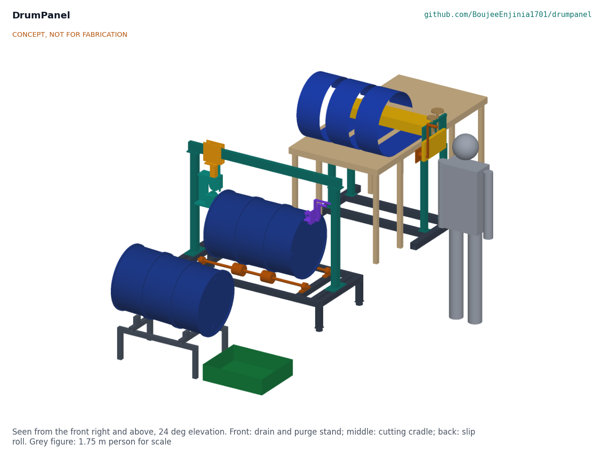

# DrumPanel design precis

Turns empty oil drums into flat sheet by purging and cold-opening them instead of burning them.

## How it works

DrumPanel is a hand-powered bench set in three stations that takes an empty 208 L oil drum to flat steel without fire. Two people run it; nothing needs electricity.

1. **Accept or reject.** Only a drum whose label shows it held a non-volatile oil is taken in. Anything else goes back.
2. **Drain and purge** (drain and purge stand). The drum lies on a low stand that slopes 2.9 degrees toward its bungs, over a tray. Residue drains out of the bottom bung; the drum is then filled with water and a little detergent through the top bung, left 10 minutes, and drained. The water settles in a spare drum and is reused.
3. **Vapour check.** A pumped gas detector samples through both bungs. The drum passes only below 5 % of the lower explosive limit; otherwise it is purged again.
4. **Heads off** (cutting cradle). The drum rolls onto four rollers that carry it on its rolling hoops. A hand-cranked end cutter clamps over the chime: a knurled wheel drives it round while a hardened wheel cuts the head out just inside the chime. A torque arm against a rail post stops it turning with the drum. Both heads come out as flat discs about 552 mm across.
5. **Notch and slit.** With a hacksaw, a 40 mm notch is cut through each chime ring and each hoop on the slit line, beside the drum's own welded seam. The drum brake is screwed on. A hand-cranked rotary shear head, hanging from a trolley on an overhead rail, is wound along the top of the drum: its upper disc is driven, its lower disc runs inside, and its thin web runs in the cut behind them, so the drum is slit from end to end.
6. **Ring cuts.** The head is swung 90 degrees on its pivot. With the brake off, the crank turns the drum on its rollers past the discs six times: once 30 mm in from each end to take off the chime rings, and once each side of each hoop to take out the hoop strips. What is left is three curled panels.
7. **Roll flat** (slip roll stand). The three panels are fed side by side, paint side up, through a hand-cranked slip roll: a pinch pair geared together drives them, and a bending roll behind bends them the other way just enough that they spring back flat. The bending roll is set by a trial pass for each batch of drums. The last 90 mm of each panel end is set flat by hand on a steel plate.
8. **Deburr.** Every cut edge is filed or scraped before the panels are stacked.

*Figure 1. The three stations: drain and purge stand (front), cutting cradle (middle), slip roll stand (back).*

## Components

*Table 1. Components, in build order. Numbers match `bom/bom.csv`.*

| BOM | Component | Role |
| --- | --- | --- |
| 1 | Drain and purge stand | Welded frame with hardwood chocks that holds a drum, full of water if need be, bung end low over the tray |
| 2 | Drain tray | Catches residue and purge water |
| 3 | Purge kit | Hose, bung adaptors, non-sparking bung wrench, settling drum fittings, detergent |
| 4 | Vapour check kit | Pumped LEL gas detector with its alarm at 5 % LEL, and bump-test gas |
| 5 | Cradle frame with levelling feet | Low welded frame; the feet also set the drum height under the rail |
| 6 | Cradle rollers, shafts and pillow blocks | Four rollers under the rolling hoops let the drum turn |
| 7 | Drum brake | Screw and pad that hold the drum still for the slit |
| 8 | Rail posts and rail beam | Portal over the cradle that carries the shear head |
| 9 | Trolley, swivel and drop bar | Carries the head along the rail; the pivot sets slit or ring position |
| 10 | Rotary shear head | Two hardened discs, driven upper and idle lower, in a frame whose web runs in the cut |
| 11 | End cutter | Cuts each head out just inside the chime |
| 12 | Roll stand base | Wide base that keeps the slip roll from tipping |
| 13 | Side frames | Plates on legs that carry the three rolls |
| 14 | Rolls | Lower and upper pinch rolls and the bending roll, 60 mm |
| 15 | Bushes, slide blocks and screws | Bronze bushes; blocks and screws that set the pinch and the bend |
| 16 | Pinch gears | Keep the pinch rolls turning together |
| 17 | Crank and chain drive | 300 mm crank and a 3:1 chain to the lower roll |
| 18 | Roll guards | Nip guards with 8 mm slots, lid, chain and gear guards |
| 19 | In-feed and out-feed tables | Support the 1.8 m panels at the sheet line |
| 20 | Finishing tools and bench plate | Plate and mallet for the panel ends; deburring tools |
| 21 | Hacksaw, snips and blades | Notches on the slit line |
| 22 | Procedure sheets | Pictogram sheets for acceptance, purge, check, cutting, rolling and finishing |
| 23 | Fasteners, paint and welding consumables | Allowance |
| 24 | Personal protective equipment | Cut-resistant gloves, glasses, ear defenders, aprons |

## Key design choices

All were decided on 2026-10-03 under Amish's pre-approval (DMP-DDR-001 and DMP-DDR-002; register DMP-DEC-001).

1. **Water purge, not air or steam.** Water displaces vapour and washes residue with no power or fuel; the water is reused.
2. **A bought pumped LEL detector, pass below 5 % LEL.** Half the usual 10 % hot-work limit, because a cold cut still has friction and a failed check costs only a second purge.
3. **Accept only drums labelled for non-volatile oils.** The purge is sized for oils, not fuels or solvents.
4. **Three panels, hoops cut out.** Straightening a rolling hoop would stretch its crown about 8 %; cutting the hoop strips out leaves three flat panels about 233 x 1,800 mm instead of one buckled sheet.
5. **One shear head for the slit and the six ring cuts.** It swivels 90 degrees on its pivot; the slit is made with the drum still, the ring cuts with the drum turning.
6. **Slip roll, not a three-roll pyramid.** A pyramid of three plain rolls cannot drive the panels by friction alone; the geared pinch pair grips them with a set force and the bending roll does the bending.
7. **Trial-pass setting.** The setting that leaves a panel flat changes with each batch of drum steel, so the first panel of each batch is used to find it.
8. **Shared bench set.** One set serves a cooperative or a cluster of workshops.

## First-order numbers

*Table 2. Key figures from DMP-CAL-001. Assumptions: drum steel yield 200 to 300 MPa, body 0.8 to 1.2 mm, heads 1.0 to 1.5 mm, shear strength 0.8 of a 360 MPa tensile strength.*

| Quantity | Value | Source |
| --- | --- | --- |
| Output per drum | Three panels 233, 234 and 233 x 1,800 mm; two head discs 552 mm | [A1 to A3] |
| Flat area per drum | 1.26 m² of panels and 0.48 m² of heads | [A4, A5] |
| Drum full of water | About 240 kg, filled and drained in place | [B2] |
| Purge | Fill 11 min at 20 L/min; drain 2.3 min; about 1.4 L left below the bung | [B3 to B5] |
| End cutter | Crank force 12 to 27 N; about 2 min a head with setting up | [C10 to C15, H7] |
| Shear head | Separating force up to 1,429 N; crank force 26 to 111 N | [D8 to D15] |
| Slip roll | Bending roll about 13.4 mm above the lower roll for 250 MPa, 1.0 mm steel; 9.3 to 19.3 mm over the range | [E10, E11] |
| Slip roll crank | 20 N at 300 mm through a 3:1 chain; feed 1.9 m/min | [E23, E24] |
| Throughput | About 2.0 drums an hour for two people (estimate) | [H5] |
| Masses | Cradle about 130 kg, slip roll stand about 189 kg, drain stand about 15 kg | [I1 to I3] |
| Cost | Value-engineering target: USD 3,000. Estimated cost of the constructable design: USD 2,794 (USD 206 under the target) | [J1 to J3] |

## Patent design-arounds

From the preliminary patent, trademark and prior-art screen (not legal advice):

- Stay manual; powered drum cutter-flatteners already exist. Every DrumPanel station is hand-cranked.
- Publish the purge and vapour check procedure openly with the design. It is in this precis, the build plan and the procedure sheets.
- Build on expired prior art such as the US3161952A drum-head cutter. The end cutter follows its principle: a wheel cutting the head just inside the chime.

## Shared blocks

- Hand crank and chain drive: the slip roll's 300 mm crank with a #40 chain at 3:1 is drawn so it can later be swapped for the proposed hand capstan common block (SaltDrag, SiltHaul) if that block is adopted (DMP-DDR-001, D10).
- CalRig proof-load: used at TRL 4 for the drain stand, frame and post checks; nothing in the TRL 3 design depends on it.

## Safety

> **Safety:** An empty oil drum can still hold flammable vapour. Never cut, grind, weld or heat a drum until the purge is done and the vapour check passes below 5 % LEL; repeat the check if a drum stands overnight.

> **Safety:** Do not process drums that held fuel, solvent, chemicals or unknown contents, or that have no readable label.

> **Safety:** Cut steel edges are sharp. Wear cut-resistant gloves and eye protection for every task that handles cut steel, and deburr every edge before panels are stacked or carried.

> **Safety:** The shear head, end cutter and slip roll have in-running nips and the slip roll has gears and a chain. Keep every guard fitted (a tool is needed to remove them), keep one person on a crank and nobody else's hands near the work, and never reach past a guard.

> **Safety:** A drum full of water weighs about 240 kg. Fill and drain it on the stand; never lift or tip a full drum. Lift anything over 25 kg with two people.

> **Safety:** Purge water carries oil. Settle it, skim the oil into a closed container for a recycler, and never pour it on the ground or into a drain.

This design is published as an open engineering reference. It is not certified equipment.

## Next steps

TRL 3 is complete on paper (DMP-CAL-001, DMP-BLD-001). The recommended next step, for Amish to authorise when the portfolio phase allows it, is TRL 4: approach the first co-design candidate, build the bench set to DMP-BLD-001, and run the first checks in its section 5, starting with the vapour check procedure and the slip roll trial pass (R2, R5).
