# DrumPanel prototype build plan

**Plan, not yet built.** How to build the first proof-of-concept prototype, component by component. Building and testing to it is TRL 4 work. Decisions are kept in the design decisions register ([docs/06-design-decisions.md](06-design-decisions.md)), not here.

## 1. What you are building

*Figure 1. Every component pulled apart and numbered in build order.*

The prototype is a hand-powered bench set in three stations that turns an empty 208 L oil drum into flat steel without fire: a drain and purge stand where the drum is washed out with water and checked for vapour, a cutting cradle where the heads are cut out and the body is slit and cut into three panels, and a slip roll that bends the curled panels flat. Beside the cradle stand a lever notching punch, which notches the drum on its slit line before it is slit, and a ring head, a second shear head that is bolted to the first so the ring cuts are made two at a time; both live on a shelf on the left rail post. The overview shows the 24 groups of parts in the order you make or fit them. Nearly everything is sawn, drilled and stick-welded from square tube and plate; the three rolls are turned on a lathe; the slitting discs, the end cutter wheel, the punches and dies, bearings, bushes, gears, chains, the gas detector and the hand tools are bought or made by a tool shop. The parts cost about USD 3,489 from the bill of materials, USD 489 over the USD 3,000 value-engineering target.

> **Safety:** An empty oil drum can still hold flammable vapour and explode when cut, ground or heated. No drum comes near the workshop's welding area, and no drum is cut until it has been purged and has passed the vapour check below 5 % LEL. Building the bench set involves stick welding, grinding and lifts of up to 34 kg; using it involves sharp cut edges and in-running nips at the discs and rolls. Work only within the safety stops of section 6. Nothing in this plan authorises cutting a drum; the first cut is TRL 4 work.

## 2. What changed to make it buildable

The concept named eight tools in words; some could not be made or could not work as described. Each change keeps what DrumPanel does and is recorded in decision record DMP-DDR-002, decided on 2026-10-03. The last four rows carry out Amish's requirement decisions of 2026-10-03 and are recorded in DMP-DDR-003.

*Table 1. Changes from the concept.*

| Component | The concept had | The buildable design has | Why |
| --- | --- | --- | --- |
| Drain and purge station | A tilting stand | A fixed stand sloping 2.9 degrees to the bung end (Figure 2) | A drum full of water weighs about 240 kg and is never tipped |
| Drum cradle and clamps | Not defined | Rollers under the rolling hoops and a screw brake (Figure 5) | The drum must turn for the ring cuts and stay still for the slit |
| End cutter | Cuts each whole end off | Cuts the head out just inside the chime (Figure 21) | No hand wheel cuts the five-layer chime seam |
| Seam slitter | A lever or crank tool | A rotary shear head on a trolley and overhead rail, web running in the cut (Figure 16) | Straight cut; the discs cannot be geared through the drum wall |
| Start of the cut | Not shown | Notches through the chime rings and hoops on the slit line | The discs cannot shear a seam or a ridge |
| Flattening rolls | A three-roll set | A slip roll: geared pinch pair and adjustable bending roll (Figure 31) | A plain three-roll set cannot drive the sheet by friction |
| Drum body | Rolled flat in one piece | Hoop strips cut out; three panels about 233 x 1,800 mm | Rolling a hoop flat would stretch it 8.5 % |
| Ring cuts | A separate tool | The same shear head swivelled 90 degrees on its pivot | One tool |
| Guards | None drawn | Disc guard with skirt, nip guards with 8 mm slots, chain and gear guards, cutter cover (Figure 36) | Fingers kept out of every nip |
| Panel ends | Not considered | Last 90 mm set by hand on the bench plate | A slip roll cannot bend them |
| Side frames | Not considered | Bolted to the base; rolls fitted in order | The lower roll cannot go between welded frames |
| Rail posts | Not drawn | 712.5 mm each side of the middle on two cross members | Room for the end cutter and the parked head |
| Notches | Cut with a hacksaw | Punched with a lever notching punch; the chime notches widened to 60 mm (Figure 23) | Four notches in about 4 minutes instead of 8 |
| Ring cuts, faster | One cut a pass | A ring head bolted to the shear head, so two cuts are made each pass (Figure 26) | Three passes instead of six |
| Shear head crank | On the upper shaft, 200 mm | On a raised crank shaft in a closed 2.33 to 1 chain drive case, 155 mm (Figure 19) | A crank on the upper shaft sweeps through the drum wall; two ring cuts on one crank stay under 150 N |
| Bending roll setting | Screws with marked handwheels | Fine-pitch screws with dials of 0.025 mm and lock nuts (Figure 33) | The setting must be within 0.29 mm and must hold |

## 3. Making the components

Make and check each component before the assembly step that needs it. Sizes are in millimetres. "Left" and "right" are as seen from the front (the drain stand side); "front" is toward the drain stand, "back" toward the slip roll. Workshop tolerance is 0.5 mm unless a step says otherwise. Weld with 3.2 mm E6013 electrodes; fillets are 4 mm on 3 mm tube and 6 mm on plate. Mark every part with its name in paint marker as you make it. No drum is in the workshop while welding or grinding.

### 3.1 Drain and purge stand

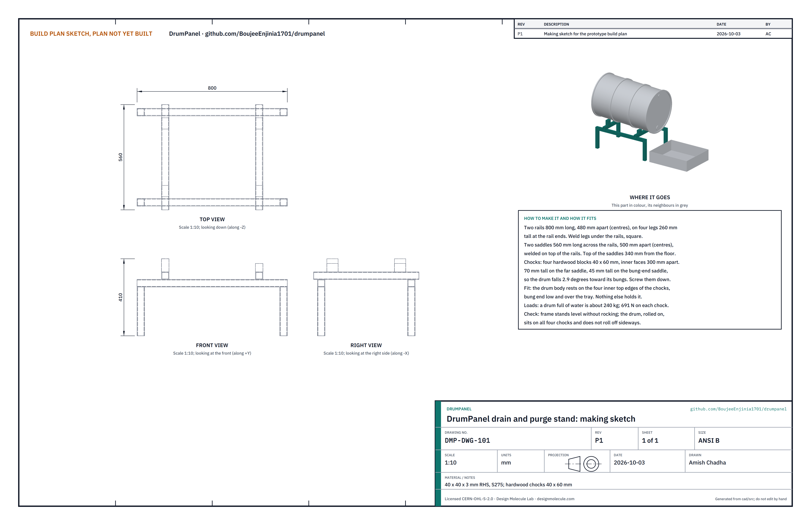

*Figure 2. Drain stand making sketch (DMP-DWG-101).*

**What it is and what it is made from.** A low frame that holds a drum on its side, bung end low, over the tray, full of water if need be. 40 x 40 x 3 mm square tube, S275; four hardwood chocks 40 x 60 mm.

**How to make it.**

1. Cut two rails 800 mm, four legs 260 mm and two saddles 560 mm from the tube.
2. Weld a leg square under each end of each rail. Lay the rails 480 mm apart between centres.
3. Weld the saddles across the top of the rails, 500 mm apart between centres, centred on the frame.
4. Cut the chocks: two 70 mm tall and two 45 mm tall. Screw the tall pair to the far saddle and the short pair to the bung-end saddle, with their inner faces 300 mm apart.

**How it fits the parts next to it.**

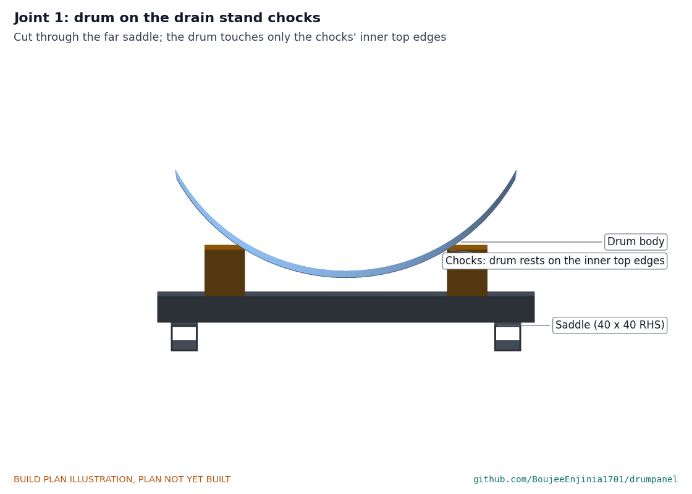

*Figure 3. Joint 1. The drum body rests on the inner top edges of the four chocks; nothing else holds it.*

The tray stands on the floor under the bung end, its near edge 60 mm beyond the stand legs.

**Check before moving on.** The stand does not rock on the floor; a drum rolled on sits on all four chocks and falls toward the bung end.

### 3.2 Cradle frame

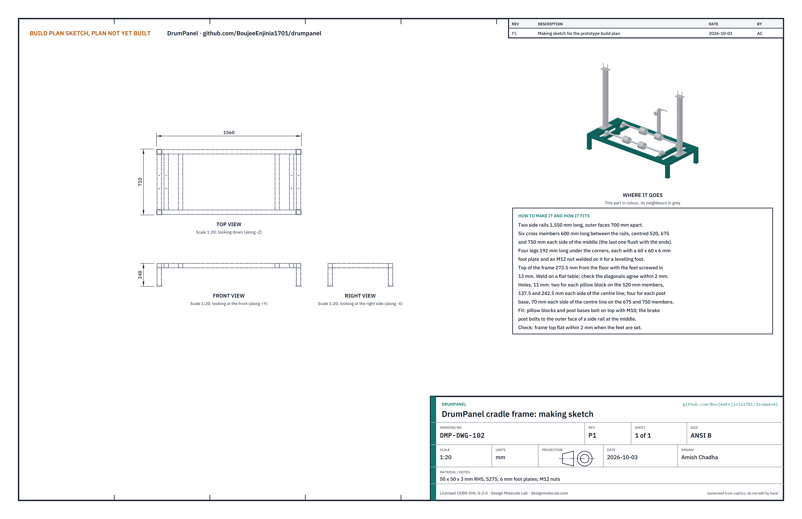

*Figure 4. Cradle frame making sketch (DMP-DWG-102).*

**What it is and what it is made from.** The low frame that carries the rollers, the brake and the two rail posts. 50 x 50 x 3 mm square tube, S275; 6 mm foot plates; four M12 nuts and levelling feet.

**How to make it.**

1. Cut two side rails 1,550 mm, six cross members 600 mm and four legs 192 mm.
2. Lay the side rails on a flat table, outer faces 700 mm apart. Weld the cross members between them, centred 520, 675 and 750 mm each side of the middle (the outer pair flush with the ends). Check the diagonals agree within 2 mm.
3. Weld a 60 x 60 x 6 mm foot plate with an M12 nut on its underside to one end of each leg; weld the legs under the four corners.
4. Drill 11 mm holes: two for each pillow block on the 520 mm cross members, 137.5 and 242.5 mm each side of the centre line; four for each post base, 70 mm each side of the centre line, on the 675 and 750 mm members.

**How it fits the parts next to it.** The pillow blocks and post bases bolt on top with M10 bolts; the brake post bolts to the outer face of the right-hand side rail at the middle.

**Check before moving on.** With the feet screwed in 13 mm, the frame top is 273.5 mm from the floor and flat within 2 mm.

### 3.3 Roller shafts with rollers (make 2)

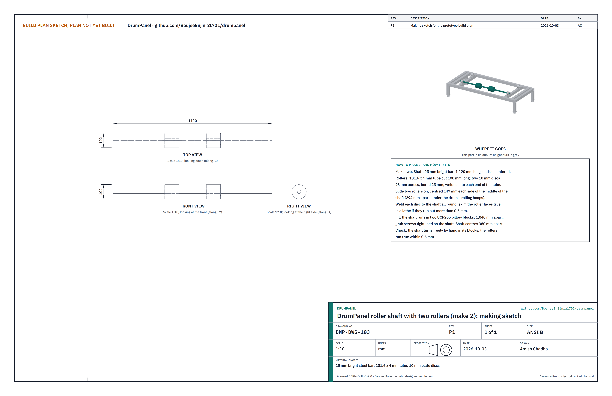

*Figure 5. Roller shaft making sketch (DMP-DWG-103).*

**What it is and what it is made from.** Two shafts, each with two rollers that carry the drum on its rolling hoops. 25 mm bright steel bar; 101.6 x 4 mm tube; 10 mm plate discs; four bought UCP205 pillow blocks.

**How to make it.**

1. Cut each shaft 1,120 mm and chamfer the ends.
2. Cut four tube pieces 100 mm long. Cut eight 10 mm discs 93 mm across, bore them 25 mm, and weld one into each end of each tube piece.
3. Slide two rollers onto each shaft, centred 147 mm each side of its middle. Weld the discs to the shaft all round.
4. Turn the roller faces true in a lathe if they run out more than 0.5 mm.

**How it fits the parts next to it.**

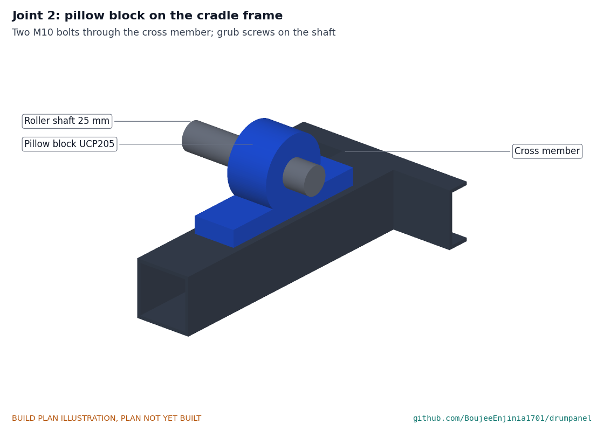

*Figure 6. Joint 2. Each pillow block sits on a 520 mm cross member with two M10 bolts; its grub screws lock the shaft.*

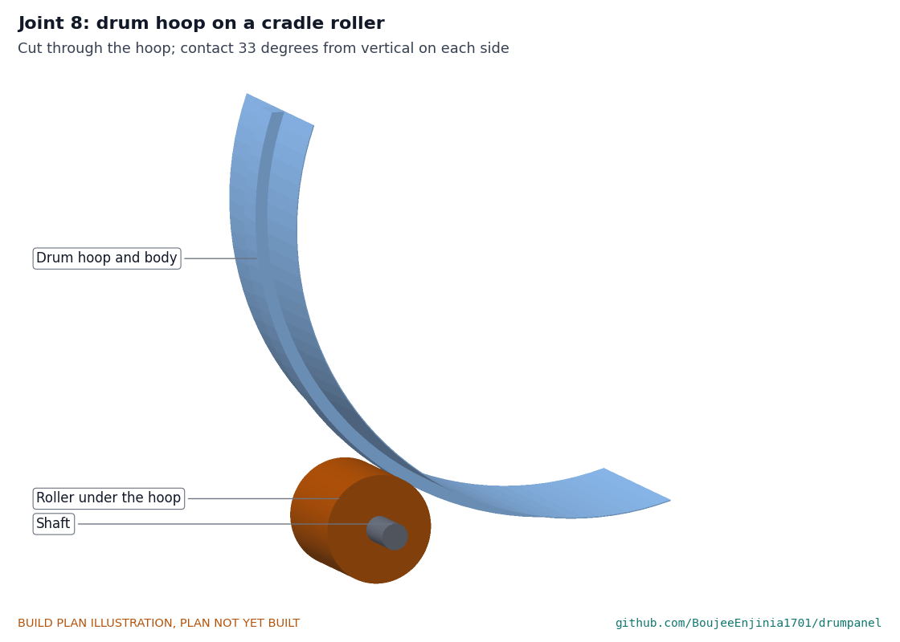

*Figure 7. Joint 8. The drum's hoop sits on the rollers at 33 degrees from vertical on each side; the shafts are 380 mm apart.*

**Check before moving on.** Each shaft turns freely by hand in its blocks; the rollers run true within 0.5 mm.

### 3.4 Drum brake

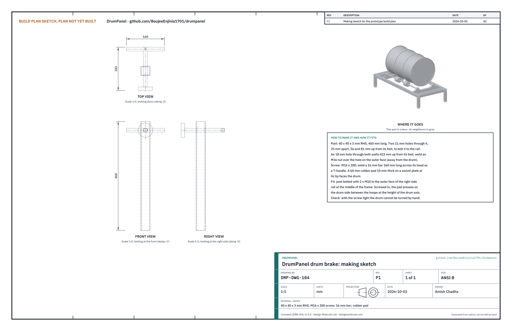

*Figure 8. Drum brake making sketch (DMP-DWG-104).*

**What it is and what it is made from.** A screw and pad that hold the drum still while it is slit. 40 x 40 x 3 mm tube; an M16 x 200 screw and nut; 16 mm bar; a 60 mm rubber pad.

**How to make it.**

1. Cut the post 460 mm. Drill two 11 mm holes 25 mm apart, 56 and 81 mm from its foot.
2. Drill an 18 mm hole through both walls 423 mm from the foot. Weld an M16 nut over it on the outer face.
3. Weld a 16 mm bar 160 mm long across the screw head as a T-handle. Fit the rubber pad on a swivel plate at the screw tip.

**How it fits the parts next to it.** The post bolts to the outer face of the right side rail at the middle of the frame with two M10 bolts. Screwed in, the pad presses on the drum side between the hoops, at the height of the drum axis.

**Check before moving on.** With the screw tight, a drum on the rollers cannot be turned by hand.

### 3.5 Rail posts (make 2)

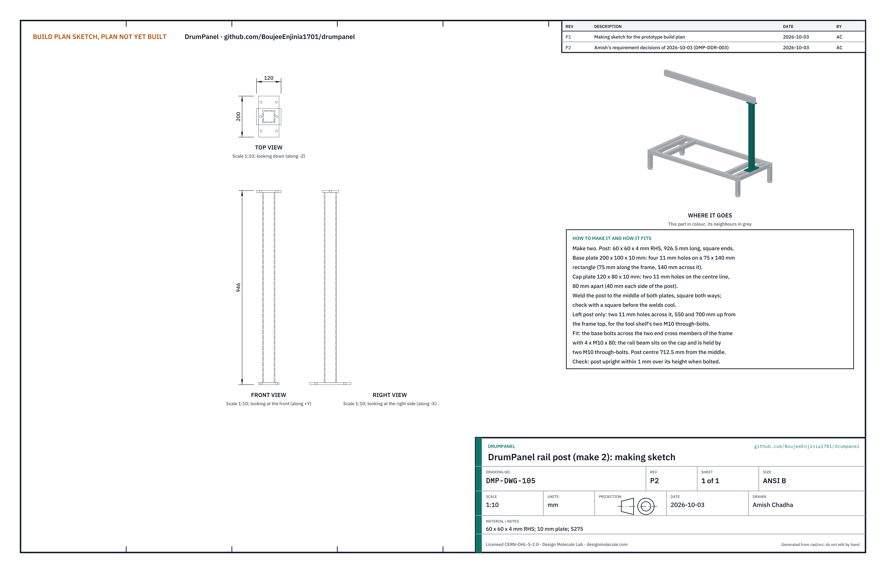

*Figure 9. Rail post making sketch (DMP-DWG-105).*

**What it is and what it is made from.** The two posts that hold the rail beam over the cradle. 60 x 60 x 4 mm tube; 10 mm plate.

**How to make it.**

1. Cut each post 926.5 mm with square ends.
2. Cut a base plate 200 x 100 mm with four 11 mm holes on a 75 x 140 mm rectangle, and a cap plate 120 x 80 mm with two 11 mm holes 80 mm apart on its centre line.
3. Weld the post to the middle of both plates, square both ways.
4. Left post only: drill two 11 mm holes straight across it, 550 and 700 mm up from the frame top, for the tool shelf's bolts.

**How it fits the parts next to it.**

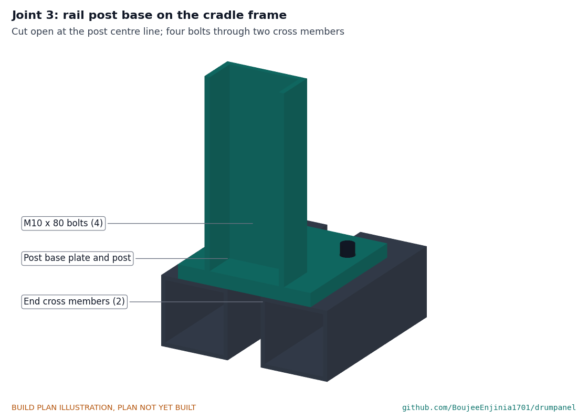

*Figure 10. Joint 3. The base plate spans the two end cross members and is held by four M10 x 80 bolts.*

**Check before moving on.** Bolted down, each post is upright within 1 mm over its height.

### 3.6 Rail beam

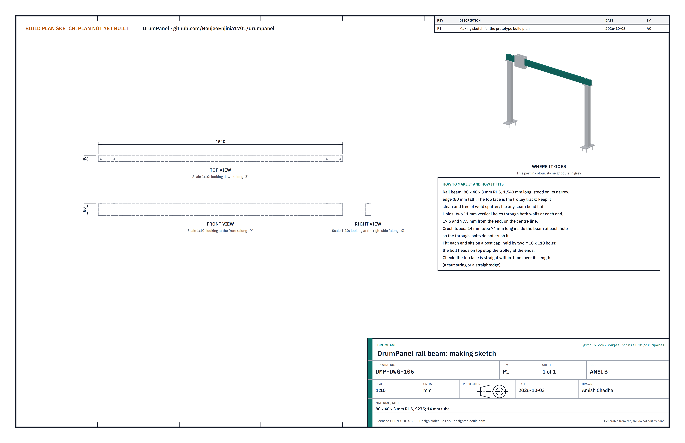

*Figure 11. Rail beam making sketch (DMP-DWG-106).*

**What it is and what it is made from.** The track the shear head runs along. 80 x 40 x 3 mm tube, 1,540 mm long, stood on its narrow edge; four short lengths of 14 mm tube.

**How to make it.**

1. Cut the beam 1,540 mm. File the top face clean of spatter and seam bead: it is the trolley track.
2. Drill two 11 mm vertical holes through both walls at each end, 17.5 and 97.5 mm from the end.
3. Push a 74 mm crush tube into the beam at each hole.

**How it fits the parts next to it.**

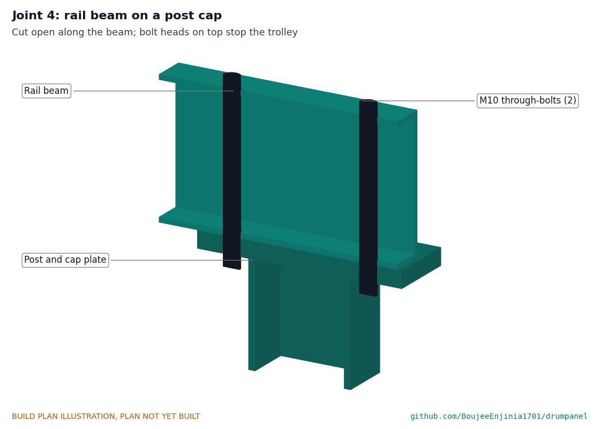

*Figure 12. Joint 4. Each end sits on a post cap and is held by two M10 x 110 through-bolts; the bolt heads stop the trolley.*

**Check before moving on.** The top face is straight within 1 mm over its length.

### 3.7 Trolley

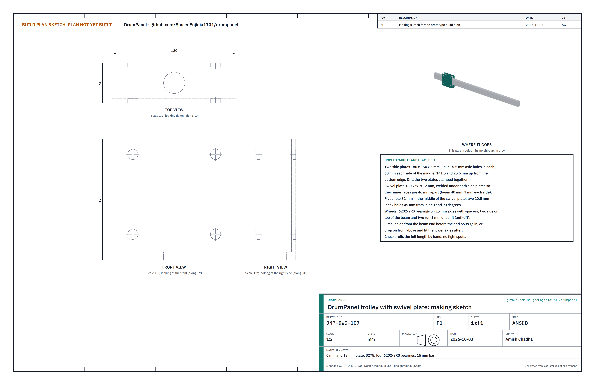

*Figure 13. Trolley making sketch (DMP-DWG-107).*

**What it is and what it is made from.** A carriage that rolls along the beam and carries the shear head on a pivot. 6 mm and 12 mm plate; four bought 6202-2RS bearings; 15 mm bar.

**How to make it.**

1. Cut two side plates 180 x 164 mm. Clamp them together and drill four 15.5 mm axle holes, 60 mm each side of the middle, 141.5 and 25.5 mm up from the bottom edge.
2. Cut a swivel plate 180 x 58 x 12 mm. Drill a 31 mm pivot hole in its middle and two 10.5 mm index holes 45 mm from it, at 0 and 90 degrees.
3. Weld the side plates on top of the swivel plate, inner faces 46 mm apart.
4. Cut four 15 mm axles 58 mm long, threaded M15 or held by circlips; spacers centre each bearing.

**How it fits the parts next to it.**

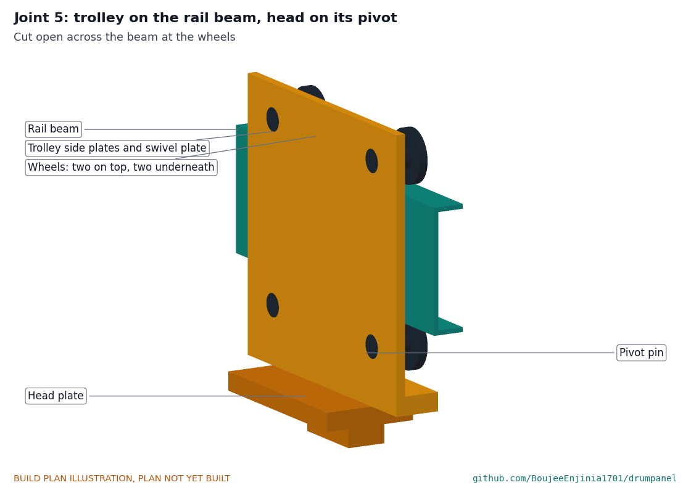

*Figure 14. Joint 5. Two wheels ride on top of the beam and two run 1 mm under it, so the trolley cannot lift off; the head plate hangs from the pivot pin.*

**Check before moving on.** The trolley rolls the full length of the beam by hand without tight spots.

### 3.8 Drop bar, head plate and pivot pin

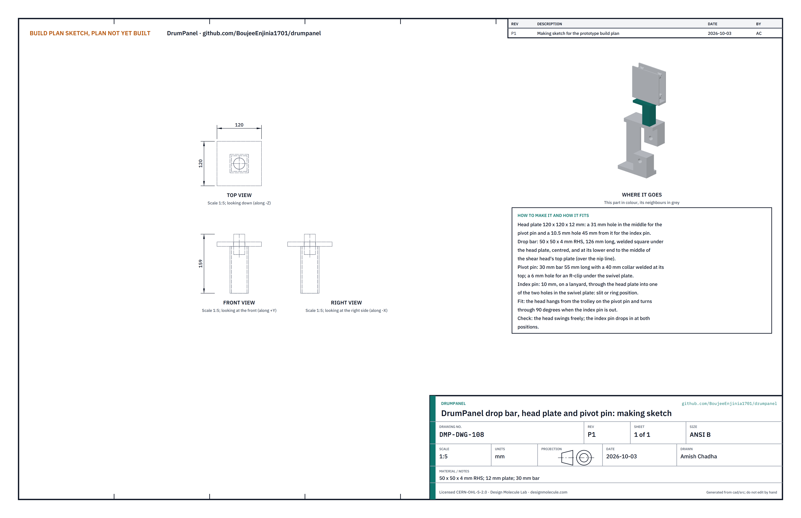

*Figure 15. Drop bar, head plate and pivot pin making sketch (DMP-DWG-108).*

**What it is and what it is made from.** The link between the trolley and the shear head. 50 x 50 x 4 mm tube; 12 mm plate; 30 and 10 mm bar.

**How to make it.**

1. Cut the head plate 120 x 120 mm; drill a 31 mm hole in its middle and a 10.5 mm hole 45 mm from it.
2. Cut the drop bar 126 mm and weld it square under the middle of the head plate.
3. Cut the pivot pin 30 mm bar, 55 mm long; weld a 40 mm collar at its top; drill a 6 mm hole for an R-clip.
4. Make a 10 mm index pin on a lanyard.
5. Weld the lower end of the drop bar to the middle of the shear head's top plate, over the nip line, once the head frame is made (section 3.9).

**How it fits the parts next to it.** The pin drops down through the swivel plate and the head plate and takes an R-clip below; the index pin locks the head in its slit or ring position.

**Check before moving on.** With the index pin out the head turns freely through 90 degrees; the index pin drops in at both positions.

### 3.9 Shear head frame

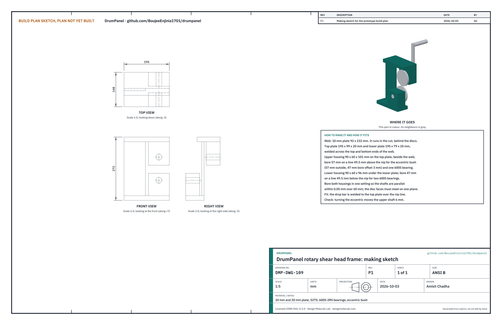

*Figure 16. Shear head frame making sketch (DMP-DWG-109).*

**What it is and what it is made from.** The frame that holds the two slitting discs. Its thin web runs in the cut behind the discs, so the head can travel the full length of the drum. 10 mm and 20 mm plate, S275; bought 6005-2RS bearings; an eccentric bush. Make two frames: the second is the ring head (section 3.14).

**How to make it.**

1. Cut the web 92 x 232 mm from 10 mm plate, the top plate 195 x 99 mm and the lower plate 195 x 79 mm from 20 mm plate.
2. Cut two bearing housings 90 x 60 mm, 101 mm tall (upper) and 96 mm tall (lower).
3. Weld the top and lower plates across the ends of the web, the upper housing under the top plate beside the web, and the lower housing on the lower plate, as the sketch shows.
4. Bore both housings in one setting so the shafts are parallel within 0.05 mm over 60 mm: the upper 57 mm on a line 49.5 mm above the nip line, for the eccentric bush; the lower 47 mm on a line 49.5 mm below it, for two bearings.
5. Make the eccentric bush: 57 mm outside, 47 mm bore offset 3 mm, with a lever and a locking set screw.
6. On the main head only, tap four M8 holes for the drive case: two in the outer face of the upper housing and two in the end of the top plate.

**How it fits the parts next to it.**

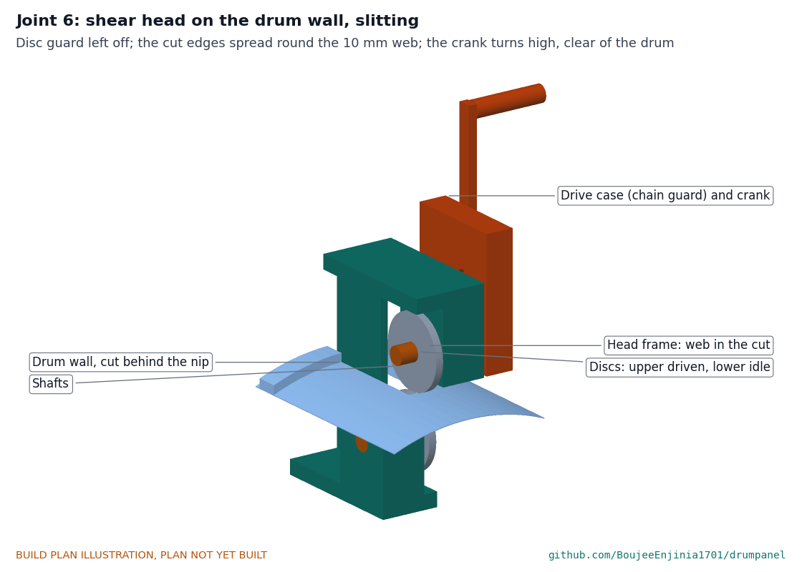

*Figure 17. Joint 6. The upper disc is driven through the drive case, the lower disc runs inside the drum, and the 10 mm web follows in the cut; the cut edges spread round it. The crank turns high on the drive case, clear of the drum. Disc guard left off for clarity.*

**Check before moving on.** Turning the eccentric moves the upper shaft through 6 mm.

### 3.10 Head shafts, discs and drive case

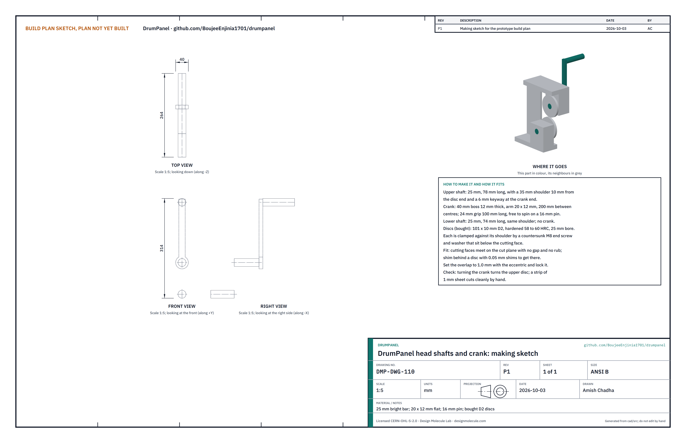

*Figure 18. Head shafts making sketch (DMP-DWG-110).*

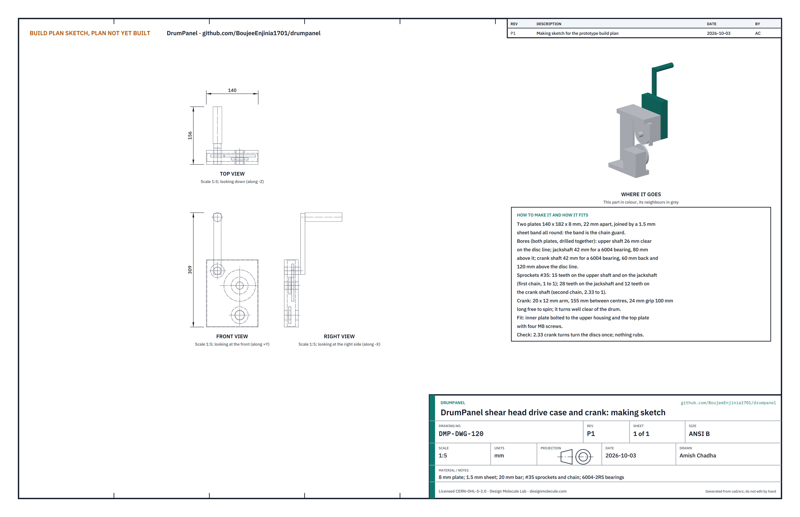

*Figure 19. Drive case and crank making sketch (DMP-DWG-120).*

**What it is and what it is made from.** The two shafts that carry the discs, and the drive case that turns the upper one from a crank set high on the side of the head, where it cannot hit the drum. 25 mm and 20 mm bright bar; 8 mm plate and 1.5 mm sheet; 20 x 12 mm flat; four bought 6004-2RS bearings; bought #35 sprockets of 12, 28 and two of 15 teeth and about 1 m of #35 chain; two bought D2 slitting discs 101 x 10 mm. Make a second set of shafts and discs, without the drive, for the ring head.

**How to make it.**

1. Turn the upper shaft 120 mm long: a 24 mm stub on the disc side with a 6 mm slot across its end for the ring head coupling, a 35 mm shoulder at the disc, and a keyway at the far end for a 15 tooth sprocket. Turn the lower shaft 74 mm long with the same shoulder.
2. Cut two plates 140 x 182 mm from 8 mm plate and drill them clamped together: a 26 mm clearance hole on the disc line for the upper shaft, and two 42 mm bearing bores, one 80 mm above the disc line for the jackshaft and one 60 mm back and 120 mm above the disc line for the crank shaft.
3. Turn the jackshaft and the crank shaft from 20 mm bar, 38 mm and 44 mm long, with keyways for their sprockets.
4. Fold a 1.5 mm sheet band to join the two plates all round, 22 mm apart; it is the chain guard. Screw it to both plates.
5. Make the crank: a 20 x 12 mm arm with 155 mm between centres and a 24 mm grip 100 mm long that spins freely on a 16 mm pin.
6. Clamp each disc against its shoulder: the lower disc with a countersunk M8 end screw, the upper disc with a clamp collar on the stub, both below the cutting face.

**How it fits the parts next to it.** The two cutting faces meet on one plane with no gap and no rub; shim behind a disc with 0.05 mm shims to get there. Set the overlap to 1.0 mm with the eccentric and lock it. The inner plate of the drive case bolts to the upper housing and the top plate with four M8 screws. The 12 tooth sprocket on the crank shaft drives the 28 tooth on the jackshaft; a 15 tooth beside it drives the 15 tooth on the upper shaft. Fit the chains with about 3 mm of slack before closing the band.

**Check before moving on.** About 2.3 turns of the crank turn the discs once; nothing rubs; a strip of 1 mm sheet cuts cleanly by hand.

### 3.11 Disc guard

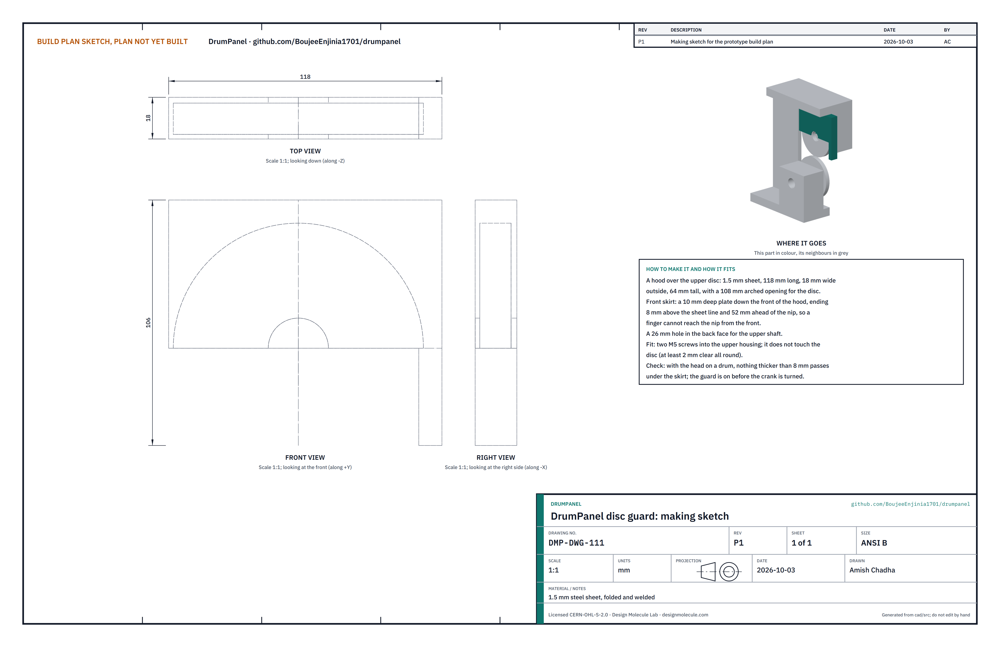

*Figure 20. Disc guard making sketch (DMP-DWG-111).*

**What it is and what it is made from.** A hood over the upper disc with a skirt at its front. 1.5 mm steel sheet. Make two: one for the ring head.

**How to make it.**

1. Fold and weld a hood 118 mm long, 18 mm wide outside and 64 mm tall, with a 108 mm arched opening for the disc and a 26 mm hole in its back face for the shaft.
2. Weld a 10 mm deep skirt down the front of the hood, ending 8 mm above the sheet line and 52 mm ahead of the nip.

**How it fits the parts next to it.** Two M5 screws into the upper housing; the hood clears the disc by at least 2 mm all round.

**Check before moving on.** With the head on a drum, nothing thicker than 8 mm passes under the skirt.

### 3.12 End cutter

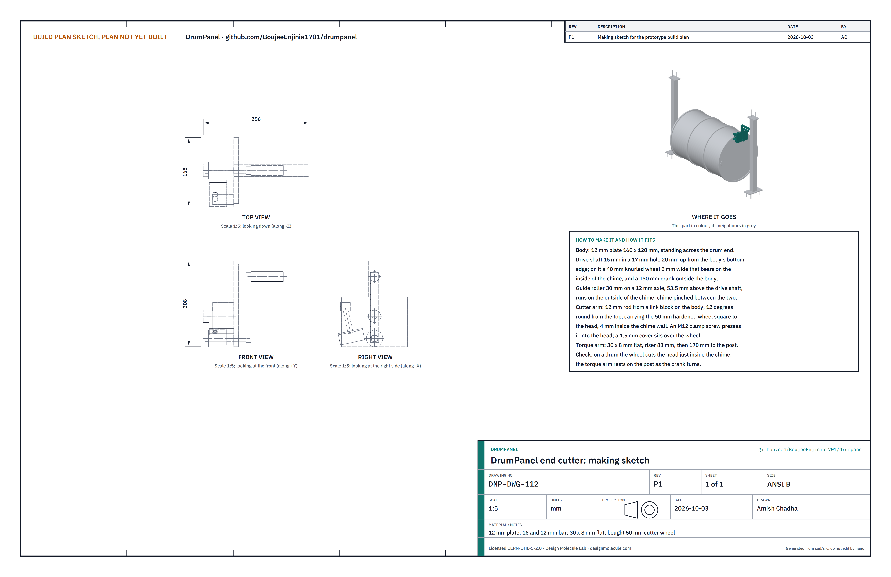

*Figure 21. End cutter making sketch (DMP-DWG-112).*

**What it is and what it is made from.** The tool that cuts each head out of the drum just inside the chime. 12 mm plate; 16 and 12 mm bar; 30 x 8 mm flat; a bought 50 mm hardened cutter wheel.

**How to make it.**

1. Cut the body 160 x 120 mm from 12 mm plate. Drill a 17 mm hole for the drive shaft 20 mm up from its bottom edge, centred.
2. Turn a 40 mm drive wheel 8 mm wide and knurl its rim; fit it on a 16 mm shaft with a 150 mm crank outside the body.
3. Turn a 30 mm guide roller on a 12 mm axle and screw the axle into the body 53.5 mm above the drive shaft, so the chime is pinched between the roller (outside) and the drive wheel (inside).
4. Make the cutter arm: a 12 mm rod from a link block on the body, set 12 degrees round from the top, carrying the cutter wheel square to the head, 4 mm inside the chime wall. Fit an M12 clamp screw that presses the wheel into the head, and a 1.5 mm cover over the wheel.
5. Make the torque arm from 30 x 8 mm flat: an 88 mm riser on the body, then 170 mm across to the rail post.

**How it fits the parts next to it.**

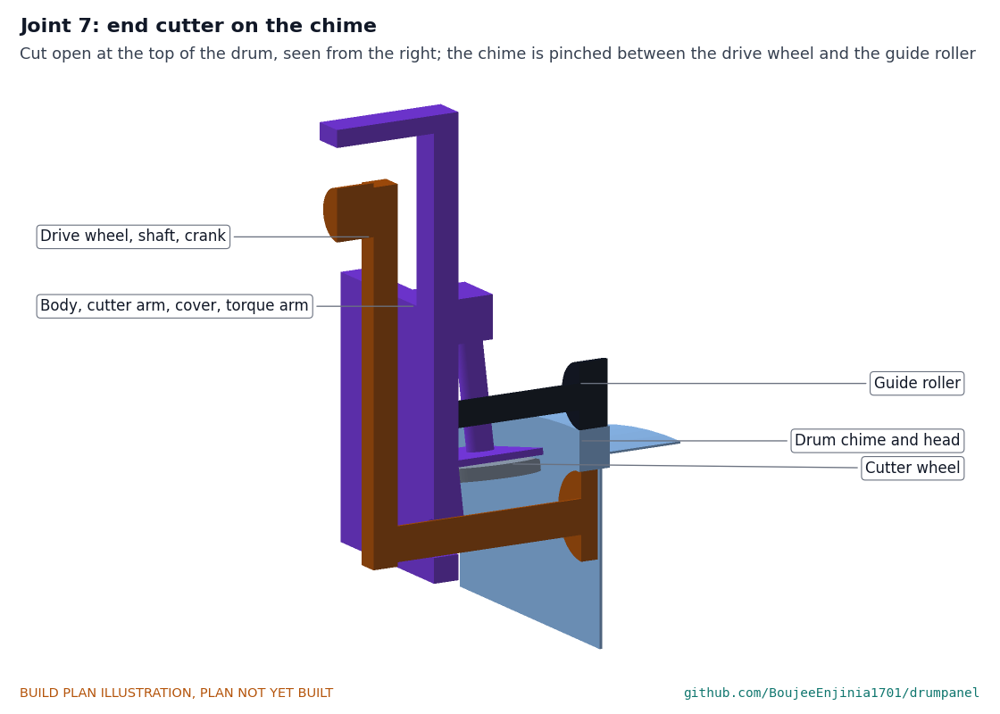

*Figure 22. Joint 7. The drive wheel bears on the inside of the chime and the guide roller on its outside; the cutter wheel bites the head just inside the chime wall.*

**Check before moving on.** On a scrap head or a purged drum, the wheel cuts just inside the chime and the torque arm rests on the post as the crank turns.

### 3.13 Lever notching punch

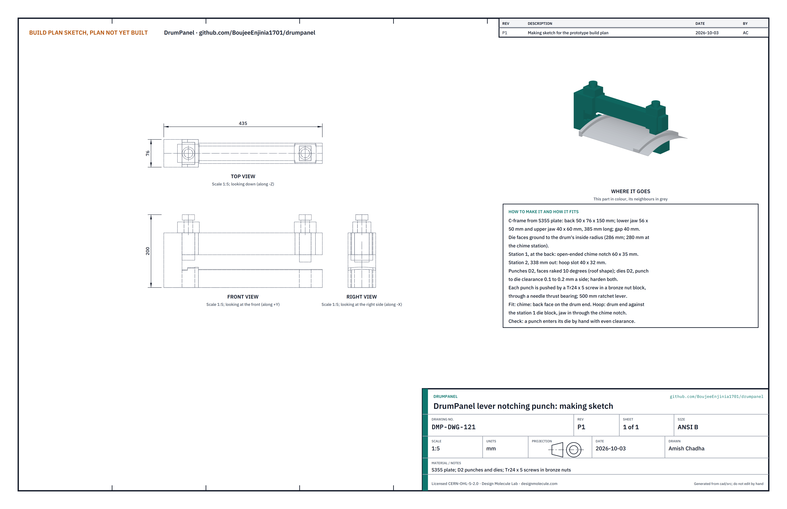

*Figure 23. Lever notching punch making sketch (DMP-DWG-121).*

**What it is and what it is made from.** A C-shaped punch that slides into the open end of a drum, with one jaw inside and one outside, and punches the four notches on the slit line that let the shear head start and pass: an open-ended notch 60 mm wide and 35 mm deep through the chime at each end, and a slot 40 x 32 mm through each hoop. S355 plate for the frame; two D2 punches and dies, made and hardened by a tool shop; two Tr24 x 5 screws in bronze nut blocks; two needle thrust bearings; a bought 500 mm ratchet lever with a socket to suit the screws. About 19 kg.

**How to make it.**

1. Cut the back 50 x 76 x 150 mm, the lower jaw 385 x 56 x 50 mm and the upper jaw 385 x 40 x 60 mm from S355 plate. Weld the jaws to the back with a 40 mm gap between them, square and parallel.
2. Weld a die block 45 x 76 mm under the back end of the gap (station 1) and a guide boss 56 mm wide over the jaw 338 mm out from the back (station 2), as the sketch shows.
3. Cut the die openings through the lower jaw: 60 x 35 mm at station 1, starting at the back face; 40 x 32 mm at station 2. Cut matching guide bores through the upper jaw and its bosses.
4. Grind the top of the lower jaw to the inside radius of the drum wall (286 mm) and the back part of the station 1 die block to the inside of the chime (280 mm), so the die faces sit on the steel.
5. Have the punches made from D2 to slide in their bores, faces raked 10 degrees from the middle to each side, with 0.1 to 0.2 mm clearance a side in their dies; harden both.
6. Bolt a nut block with its Tr24 x 5 bronze nut over each station; fit a screw with a hex head, and a needle thrust bearing between screw and punch.

**How it fits the parts next to it.**

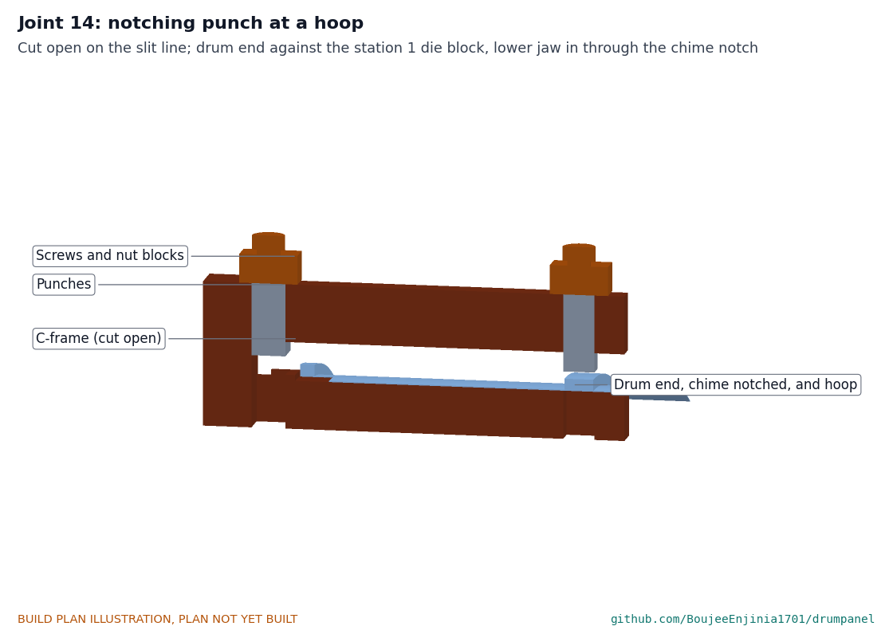

*Figure 24. Joint 14. Cut open on the slit line. For a hoop slot the drum end rests against the station 1 die block and the lower jaw goes in through the chime notch already cut; the die face sits on the inside of the wall under the hoop.*

Cut the two chime notches first, with the back face of the punch on the drum end and the station 1 die under the chime. Then cut each hoop slot from its own end. Run each punch down by hand until it touches, then work the ratchet lever (about 18 swings for a chime, 8 for a hoop).

**Check before moving on.** Each punch enters its die by hand with an even gap all round; on a scrap chime and a scrap hoop it cuts a clean notch with no more than 150 N on the lever.

### 3.14 Ring head, spacer plate and coupling

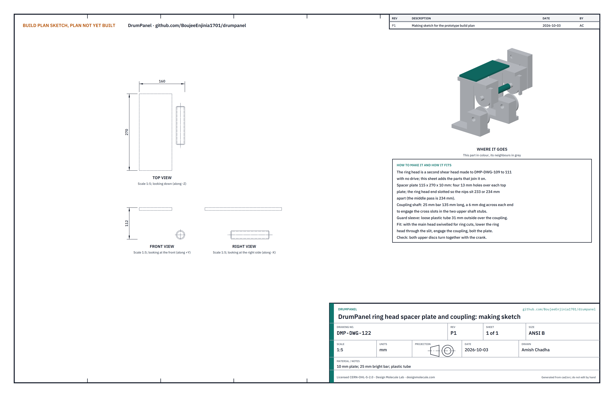

*Figure 25. Ring head spacer plate and coupling making sketch (DMP-DWG-122).*

**What it is and what it is made from.** A second shear head that is bolted to the main head for the ring cuts, so two cuts are made in each pass. Its frame, shafts, discs and guard are made to the same sketches as the main head's (sections 3.9 to 3.11) without a drive. 10 mm plate for the spacer plate; 25 mm bright bar for the coupling; a plastic tube for its guard sleeve. About 20 kg.

**How to make it.**

1. Make the second frame, shafts, discs and guard to sections 3.9 to 3.11. Its upper shaft is 98 mm long, with the same slotted stub, and has no sprocket.
2. Cut the spacer plate 115 x 270 mm from 10 mm plate. Drill four 13 mm holes over the main head's top plate and slot four over the ring head's, so the nips can sit 233 or 234 mm apart.
3. Cut the coupling shaft 135 mm long from 25 mm bar and weld a 6 mm dog across each end to engage the slots in the two upper shaft stubs.
4. Cut a loose plastic guard sleeve, 31 mm outside, to cover the coupling between the two heads.

**How it fits the parts next to it.**

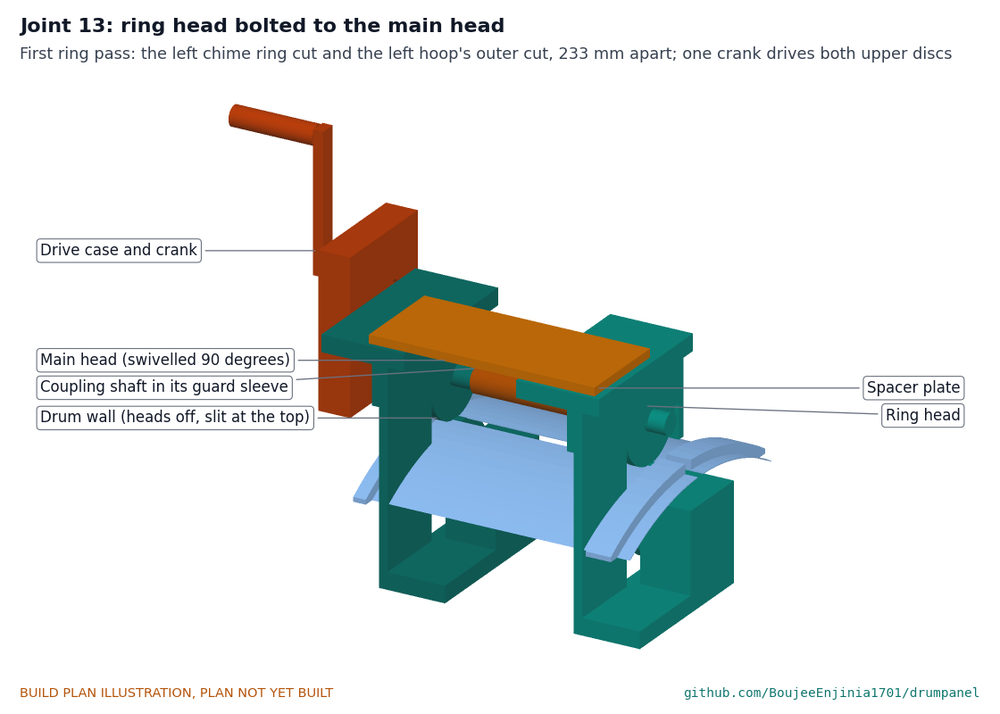

*Figure 26. Joint 13. With the main head swivelled for ring cuts, the ring head is lowered through the slit 233 mm along the drum; the spacer plate bolts across both top plates and the coupling joins the two upper shafts, so one crank drives both upper discs.*

**Check before moving on.** Bolted together on the bench, both upper discs turn together when the crank is turned; the two cut planes are parallel within 0.5 mm.

### 3.15 Tool shelf

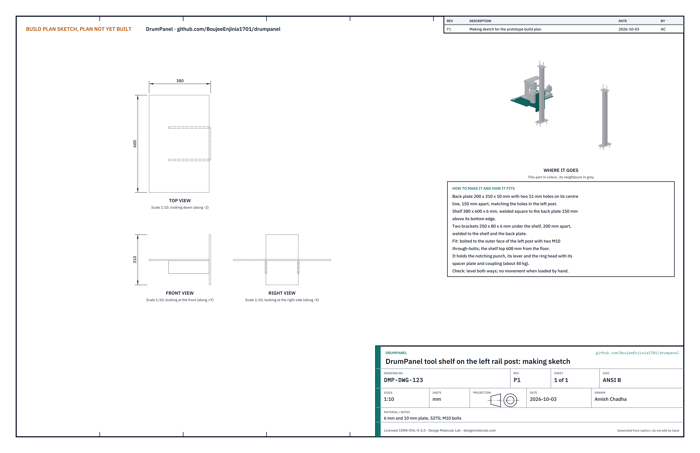

*Figure 27. Tool shelf making sketch (DMP-DWG-123).*

**What it is and what it is made from.** A shelf on the outer face of the left rail post that holds the notching punch, its lever and the ring head with its spacer plate and coupling. 6 mm and 10 mm plate, S275; two M10 bolts. About 14 kg.

**How to make it.**

1. Cut the back plate 200 x 310 mm from 10 mm plate and drill two 11 mm holes on its centre line, 150 mm apart, to match the holes in the left post.
2. Cut the shelf 380 x 600 mm and two brackets 250 x 80 mm from 6 mm plate. Weld the shelf square to the back plate, 150 mm above its bottom edge, with the brackets under it 200 mm apart.

**How it fits the parts next to it.** Two M10 through-bolts hold it to the outer face of the left post, the shelf top 608 mm from the floor.

**Check before moving on.** The shelf is level both ways and does not move when pressed down hard by hand.

### 3.16 Roll stand base

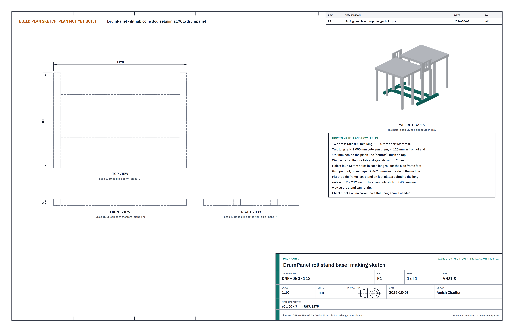

*Figure 28. Roll stand base making sketch (DMP-DWG-113).*

**What it is and what it is made from.** A wide base that keeps the slip roll from tipping. 60 x 60 x 3 mm tube, S275.

**How to make it.**

1. Cut two cross rails 800 mm and two long rails 1,000 mm.
2. Weld the long rails between the cross rails, 120 mm in front of and 190 mm behind the pinch line (centres), the cross rails 1,060 mm apart.
3. Drill two 13 mm holes per side frame foot in the long rails, 50 mm apart, 467.5 mm each side of the middle.

**How it fits the parts next to it.** Each side frame foot bolts to a long rail with two M12 bolts.

**Check before moving on.** The base does not rock on a flat floor; shim it if needed.

### 3.17 Side frames (make 2, mirror pair)

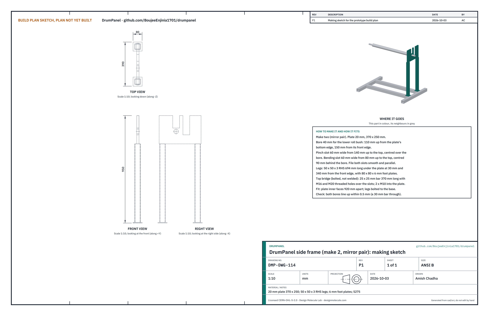

*Figure 29. Side frame making sketch (DMP-DWG-114).*

**What it is and what it is made from.** The two frames that carry the rolls. 20 mm plate 370 x 250 mm; 50 x 50 x 3 mm tube legs; 6 mm foot plates; a 25 mm top bridge bar.

**How to make it.**

1. Cut the plate 370 x 250 mm. Bore 40 mm for the lower roll bush, 110 mm up from the bottom edge and 150 mm from the front edge.
2. Cut the pinch slot 60 mm wide from 140 mm up to the top edge, centred over the bore, and the bending slot 60 mm wide from 80 mm up to the top, centred 90 mm behind the bore. File both smooth and parallel.
3. Weld two legs 694 mm long under the plate, at 30 and 340 mm from its front edge, each with an 80 x 80 x 6 mm foot plate drilled for two M12 bolts.
4. Make the top bridge: 25 x 25 mm bar 370 mm long, with an M16 threaded hole over the pinch slot and an M20 threaded hole over the bending slot; drill it for two M10 bolts into the plate's front and back prongs.

**How it fits the parts next to it.**

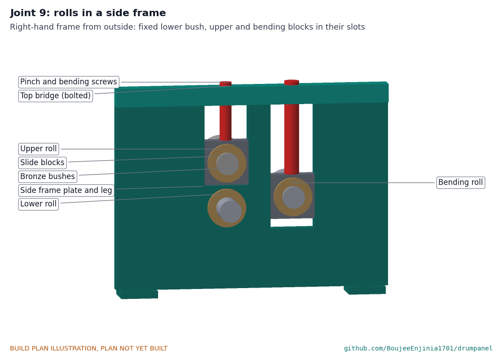

*Figure 30. Joint 9. The lower roll runs in a fixed bush; the upper and bending rolls run in bushes in slide blocks, moved by the screws in the bolted top bridge.*

**Check before moving on.** With both frames on the base, a 30 mm bar passes through both lower bores; they line up within 0.5 mm.

### 3.18 Rolls (make 3)

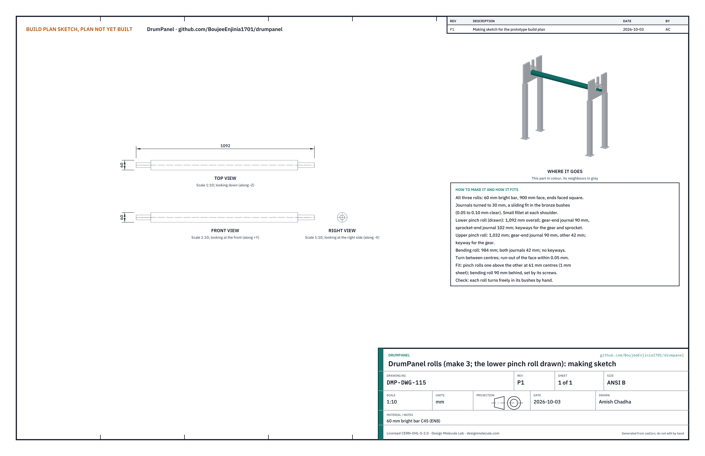

*Figure 31. Rolls making sketch, lower pinch roll drawn (DMP-DWG-115).*

**What it is and what it is made from.** The lower and upper pinch rolls and the bending roll. 60 mm bright bar, C45 (EN8).

**How to make it.**

1. Cut and face the bars: lower roll 1,092 mm, upper roll 1,032 mm, bending roll 984 mm. Each has a 900 mm face.
2. Turn 30 mm journals, a sliding fit in the bronze bushes (0.05 to 0.10 mm clear), with a small fillet at each shoulder: lower roll 90 mm at the gear end and 102 mm at the sprocket end; upper roll 90 mm at the gear end and 42 mm at the other; bending roll 42 mm at each end.
3. Cut keyways for the gears (both pinch rolls) and the sprocket (lower roll).
4. Turn between centres; the face runs true within 0.05 mm.

**How it fits the parts next to it.**

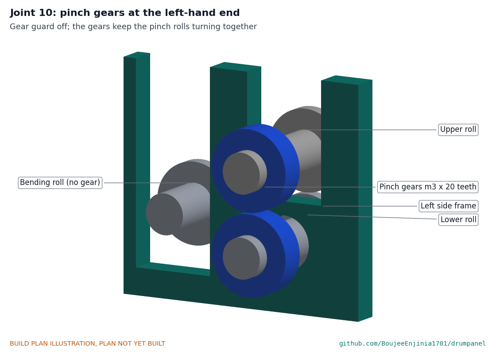

*Figure 32. Joint 10. The two pinch gears at the left-hand end keep the pinch rolls turning together; the bending roll has no gear.*

**Check before moving on.** Each roll turns freely in its bushes by hand.

### 3.19 Slide blocks, bushes and screws

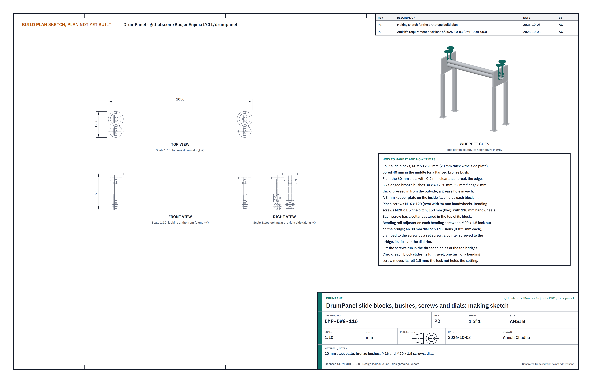

*Figure 33. Slide blocks, bushes, screws and dials making sketch (DMP-DWG-116).*

**What it is and what it is made from.** Blocks that let the upper and bending rolls move up and down, the screws that move them, and the dials that set the bending roll. 20 mm plate; six bought flanged bronze bushes 30 x 40 x 20 mm; M16 screws and fine-pitch M20 x 1.5 screws; handwheels; two 80 mm dials, two M20 x 1.5 lock nuts and two pointers.

**How to make it.**

1. Cut four blocks 60 x 60 x 20 mm and bore each 40 mm in the middle. They should slide in the 60 mm slots with 0.2 mm clearance; break the edges.
2. Press a flanged bush into each block and into each lower bore from the outside; drill a grease hole in each.
3. Make a 3 mm keeper plate for the inside face of each block.
4. Fit a captive collar at the tip of each screw (two M16 x 120 pinch screws, two fine-pitch M20 x 1.5 x 150 bending screws) so it can push and pull its block. Fit 90 mm handwheels on the pinch screws and 110 mm handwheels on the bending screws. Tap the bending screw holes in the top bridges M20 x 1.5.
5. Turn two dials 80 mm across and 8 mm thick, bored 20 mm, with a set screw; engrave 60 divisions round the rim, every tenth numbered. Each division is 0.025 mm of bending roll movement.
6. Bend two pointers from 10 x 5 mm strip to stand on the bridge with their tips over the dial rims.

**How it fits the parts next to it.** The screws run in the threaded holes of the top bridges (Joint 9). On each bending screw, the lock nut runs down onto the bridge, the dial sits above it clamped to the screw, and the pointer is screwed to the bridge. To set the roll: slacken both lock nuts, turn both screws to the same dial reading, then tighten the lock nuts.

**Check before moving on.** Each block slides through its full travel when its screw is turned; one turn of a bending screw moves its roll 1.5 mm; with the lock nut tight, the dial reading does not change when the handwheel is pushed by hand.

### 3.20 Crank bracket, crank and chain drive

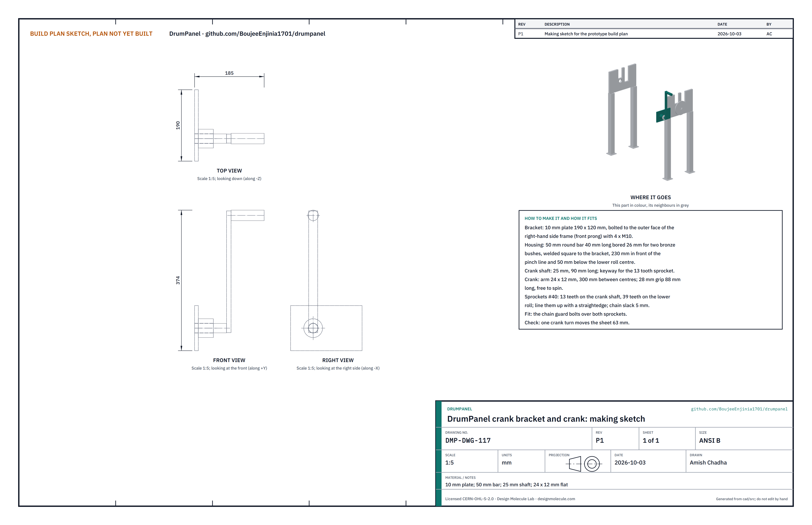

*Figure 34. Crank bracket and crank making sketch (DMP-DWG-117).*

**What it is and what it is made from.** The 300 mm crank and the 3:1 chain that drive the lower roll. 10 mm plate; 50 mm round bar; 25 mm shaft; 24 x 12 mm flat; bought #40 sprockets of 13 and 39 teeth and chain.

**How to make it.**

1. Cut the bracket 190 x 120 mm from 10 mm plate and drill four 11 mm holes to match the right-hand side frame's front prong.
2. Bore a 50 mm bar 40 mm long to 26 mm for two bronze bushes; weld it square to the bracket so the crank shaft sits 230 mm in front of the pinch line and 50 mm below the lower roll centre.
3. Cut the crank shaft 25 mm, 90 mm long, with a keyway for the 13 tooth sprocket. Make the crank: 24 x 12 mm arm, 300 mm between centres, with a 28 mm grip 88 mm long that spins freely.

**How it fits the parts next to it.**

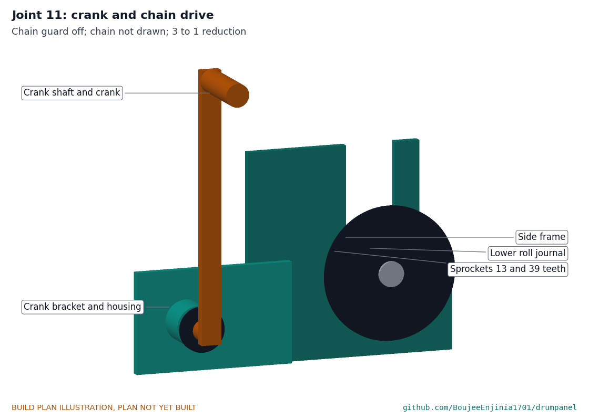

*Figure 35. Joint 11. The 13 tooth sprocket on the crank shaft drives the 39 tooth sprocket on the lower roll. Chain guard off and chain not drawn.*

**Check before moving on.** The sprockets line up under a straightedge; one crank turn moves a panel 63 mm.

### 3.21 Roll guards

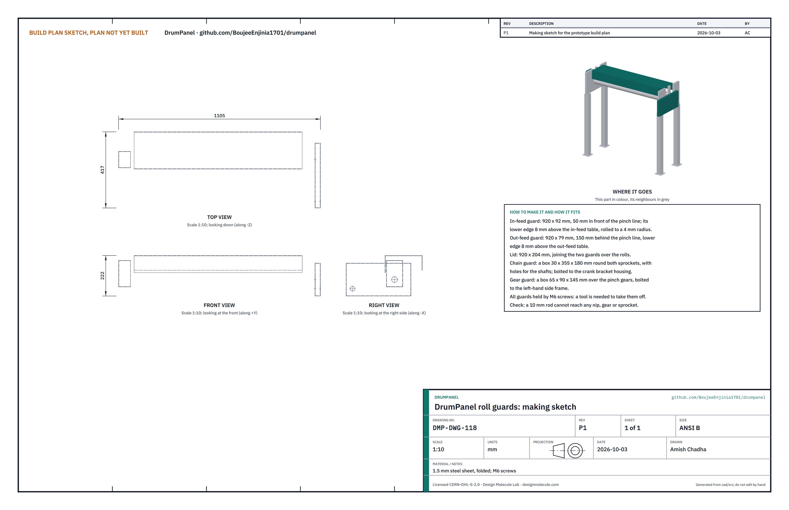

*Figure 36. Roll guards making sketch (DMP-DWG-118).*

**What it is and what it is made from.** Guards that keep fingers out of the roll nips, the gears and the chain. 1.5 mm steel sheet; M6 screws.

**How to make it.**

1. In-feed guard 920 x 92 mm, its lower edge rolled to a 4 mm radius; out-feed guard 920 x 79 mm; lid 920 x 204 mm joining them over the rolls.
2. Chain guard: a box 30 x 355 x 180 mm round both sprockets, with holes for the shafts.
3. Gear guard: a box 65 x 90 x 145 mm over the pinch gears.

**How it fits the parts next to it.**

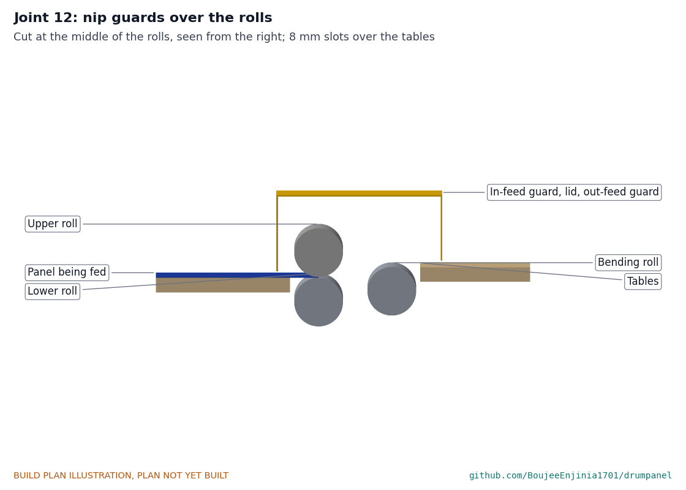

*Figure 37. Joint 12. The in-feed guard stands 50 mm in front of the pinch line with an 8 mm slot over the in-feed table; the out-feed guard 150 mm behind it with an 8 mm slot.*

All guards are held by M6 screws, so a tool is needed to remove them.

**Check before moving on.** A 10 mm rod cannot reach any nip, gear or sprocket.

### 3.22 In-feed and out-feed tables

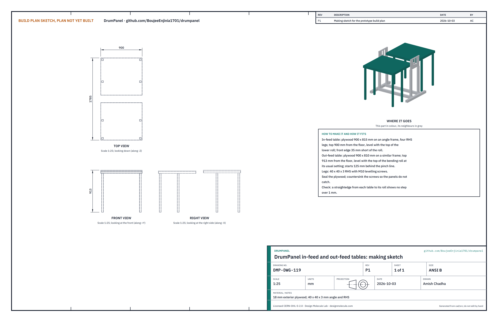

*Figure 38. Tables making sketch (DMP-DWG-119).*

**What it is and what it is made from.** Tables that carry the 1.8 m panels into and out of the rolls. 18 mm exterior plywood; 40 x 40 x 3 mm angle and tube.

**How to make it.**

1. In-feed table: plywood 900 x 815 mm on an angle frame with four tube legs; top 900 mm from the floor, level with the top of the lower roll, front edge 35 mm short of the roll.
2. Out-feed table: plywood 900 x 810 mm on a similar frame; top 913 mm from the floor; it starts 125 mm behind the pinch line.
3. Seal the plywood and countersink the screws so panels do not catch.

**How it fits the parts next to it.** Each table stands on its own legs with M10 levelling screws, butted up to the roll stand.

**Check before moving on.** A straightedge from each table to its roll shows no step over 1 mm.

### 3.23 Bought components

- **Drain tray:** HDPE oil drain tray about 600 x 500 x 150 mm.
- **Purge kit:** 15 m of 19 mm hose, 3/4 in bung hose adaptor, 2 in bung drain spout, a non-sparking (brass or bronze) bung wrench, a tap fitted to a spare drum as the settling drum, biodegradable detergent.
- **Vapour check kit:** a portable combustible gas detector with a catalytic bead or infrared LEL sensor, a sampling pump and a 1 m probe hose, its alarm settable at 5 % LEL (a 4-gas meter is fine), and 50 % LEL bump-test gas with a regulator. Read its manual; set the alarm before first use.
- **Pillow blocks:** four UCP205 (25 mm bore).
- **Slitting discs:** four D2 discs 101 x 10 mm, 25 mm bore, 58 to 60 HRC (two for the shear head, two for the ring head).
- **End cutter wheel:** one hardened wheel 50 x 6 mm, sold as a drum deheader or rotary cutter spare; bore it to suit the arm if needed.
- **Bearings and bushes:** four 6202-2RS (trolley), six 6005-2RS (shear head and ring head), four 6004-2RS (drive case), two needle thrust bearings to suit the punch screws, six flanged bronze bushes 30 x 40 x 20 mm and two 25 x 30 x 20 mm.
- **Gears and chains:** two spur gears module 3, 20 teeth, 20 mm face, bored 30 mm with keyway; #40 sprockets of 13 and 39 teeth and about 1.3 m of #40 chain (slip roll); #35 sprockets of 12, 28 and two of 15 teeth and about 1 m of #35 chain (shear head drive case).
- **Notching punch parts:** two Tr24 x 5 screws with bronze nuts; two D2 punch and die sets made and hardened by a tool shop to sketch DMP-DWG-121; a 500 mm ratchet lever with a socket to fit the screw heads.
- **Finishing tools:** a 10 mm steel plate 600 x 400 mm, a 1.5 kg dead-blow mallet, a swivel-blade deburring tool, flat and half-round files.
- **Procedure sheets and protective equipment:** laminated pictogram sheets; cut-resistant gloves (EN 388 level C or higher), safety glasses, ear defenders, leather aprons, nitrile gloves.

## 4. Putting it together

In each picture the parts already fitted are grey and the part being fitted is in colour, with an arrow showing the way it goes in. Two people for every lift over 25 kg.

### Step 1: drain stand chocks and tray

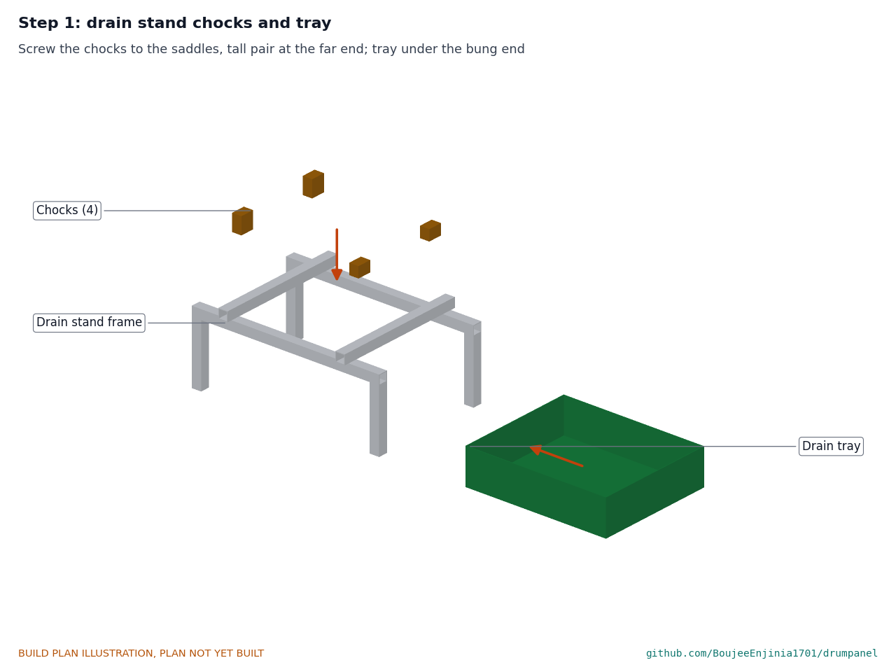

Screw the chocks to the saddles, the tall pair at the far end. Set the tray under the bung end. Place the stand on a drained floor away from the welding area.

### Step 2: cradle frame on its levelling feet

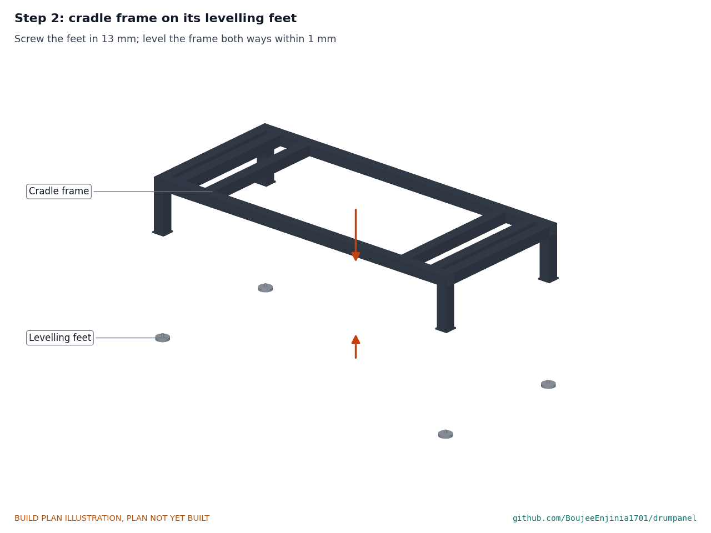

Two people: set the frame down, screw the four feet in about 13 mm, and level it both ways within 1 mm.

### Step 3: pillow blocks and roller shafts

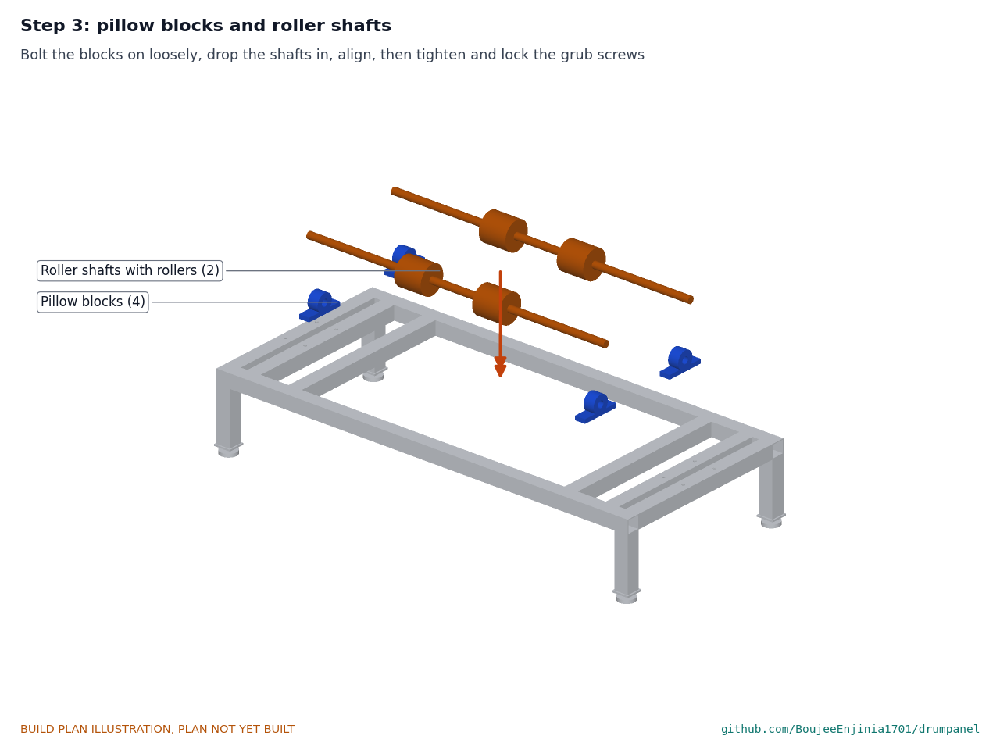

Bolt the four pillow blocks on loosely, drop the two shafts into them, line the shafts up parallel 380 mm apart, then tighten the bolts and lock the grub screws.

### Step 4: drum brake

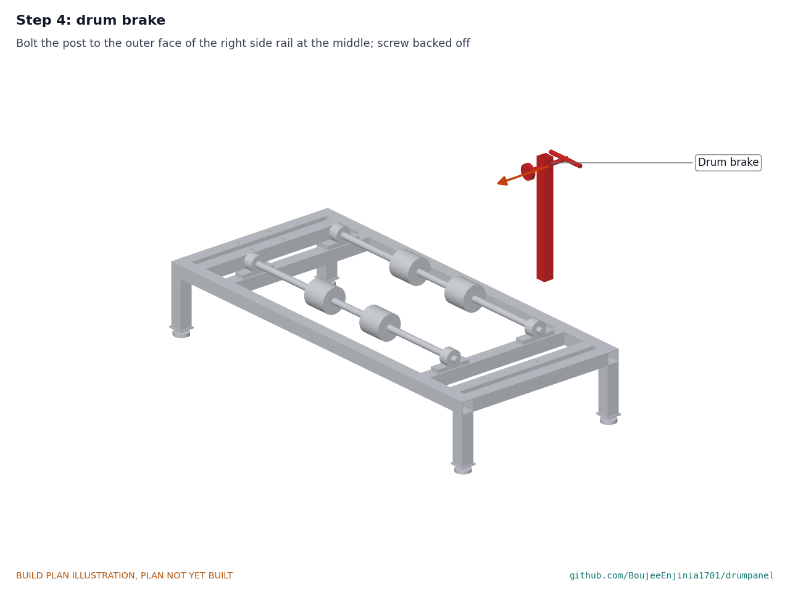

Bolt the brake post to the outer face of the right side rail at the middle with two M10 bolts. Back the screw off.

### Step 5: rail posts

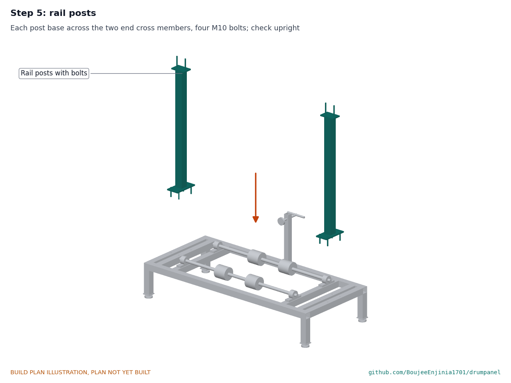

Stand each post with its base across the two end cross members and fit four M10 x 80 bolts. Check it upright before tightening.

### Step 6: rail beam and trolley

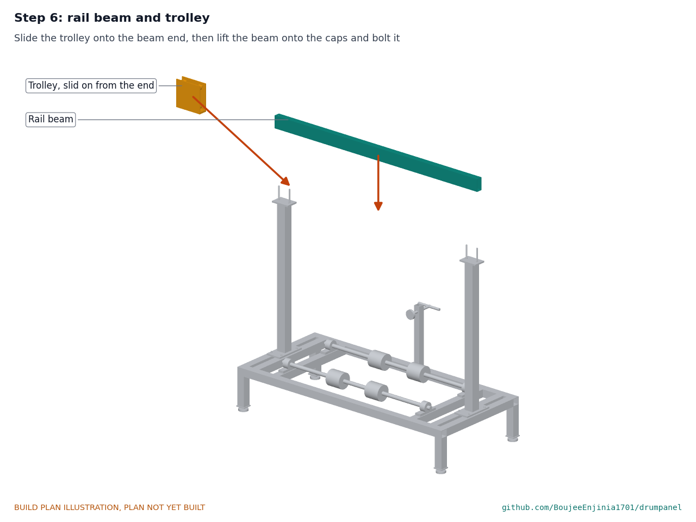

Slide the trolley onto one end of the beam with its lower wheels fitted. Two people: lift the beam onto the post caps and fit the four through-bolts with their crush tubes.

### Step 7: shear head onto the trolley

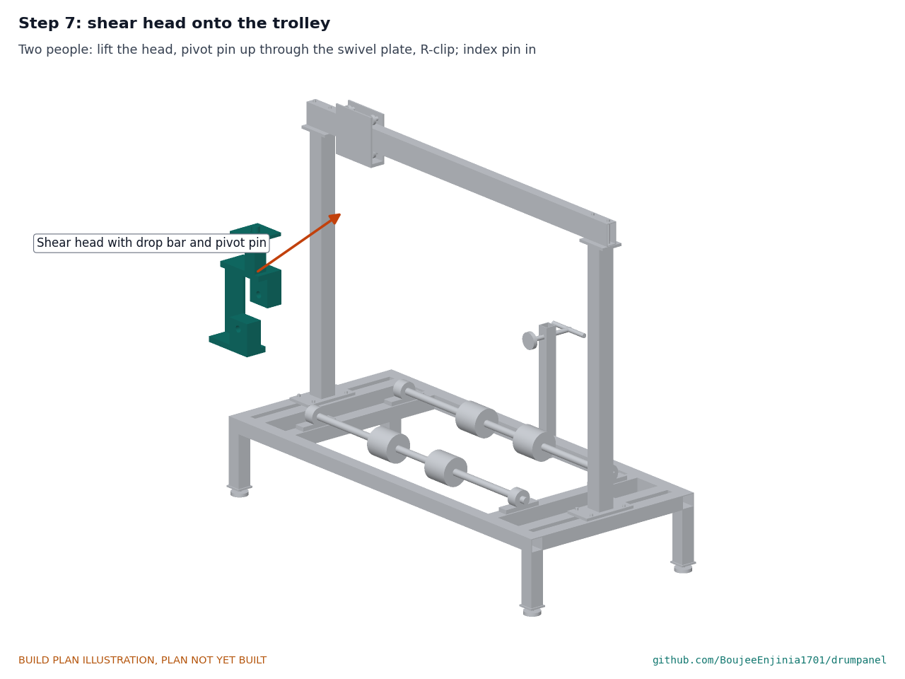

Two people: lift the head (about 20 kg with its drop bar), push the pivot pin up through the swivel plate and head plate, and fit the R-clip. Put the index pin in at the slit position.

### Step 8: shafts, discs, guard and drive case

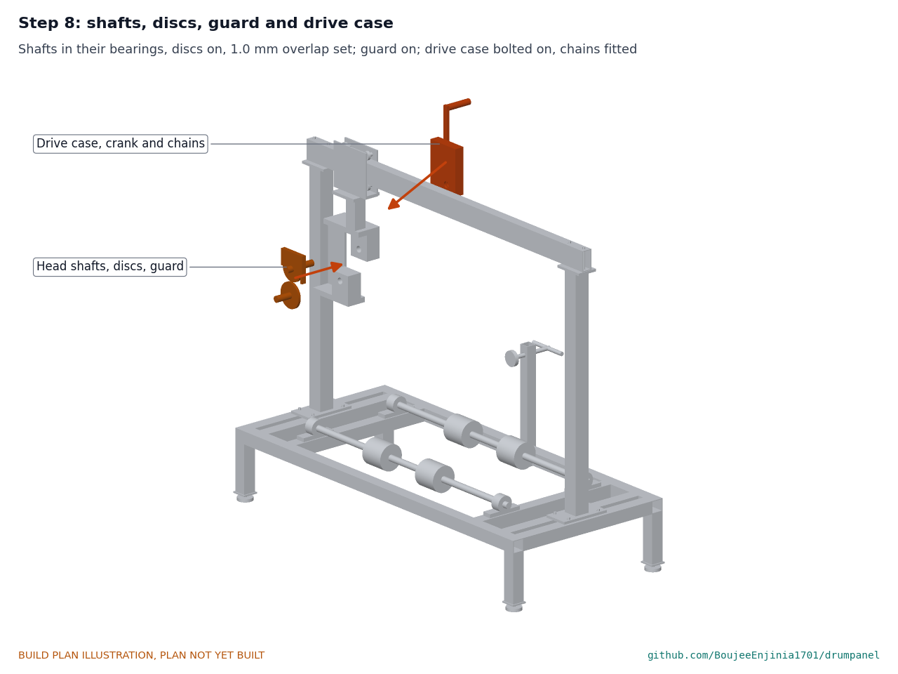

Fit the bearings, the eccentric bush and the shafts; clamp the discs on; set the 1.0 mm overlap with the eccentric and lock it. Fit the disc guard. Bolt the drive case's inner plate to the head with its four M8 screws, fit the jackshaft, the crank shaft, the sprockets and both chains, then close the case with its band and outer plate before the crank is ever turned.

### Step 9: end cutter on a drum

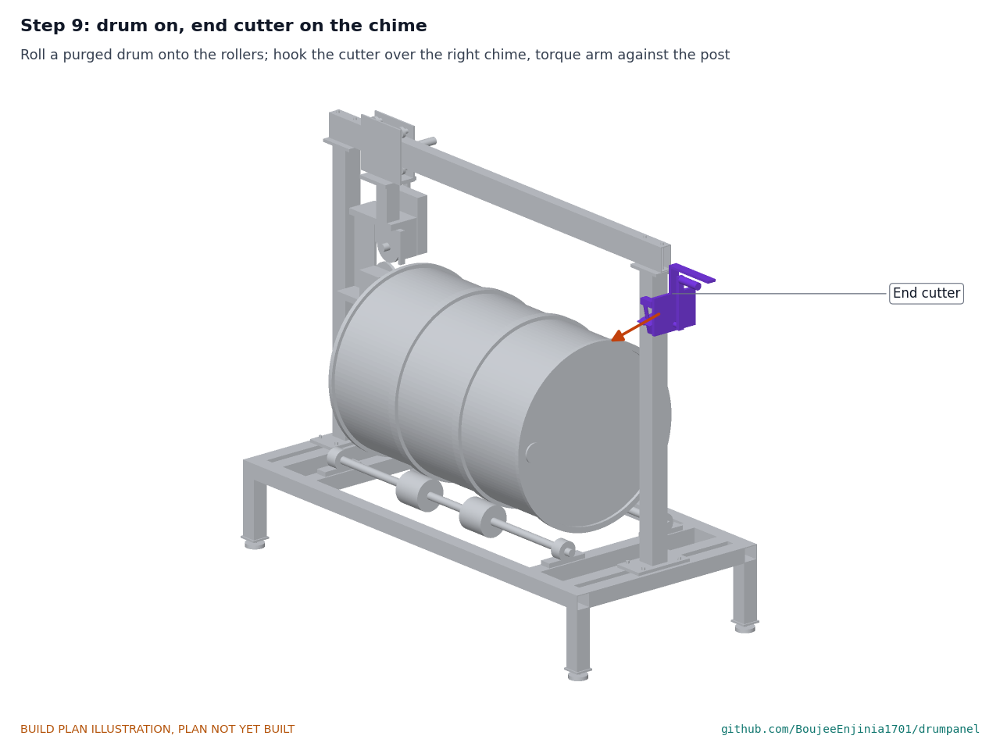

Only after safety stop S4: roll a purged and checked drum onto the rollers. Hook the end cutter over the right-hand chime, set the clamp screw, and rest the torque arm against the post. Set the drum top under the head by the levelling feet so the discs nip the wall.

### Step 10: tool shelf, notching punch and ring head

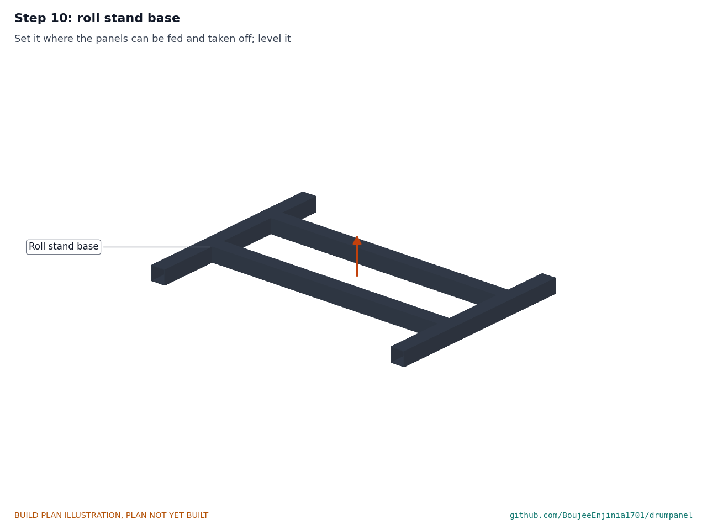

Bolt the shelf to the outer face of the left post with its two M10 through-bolts. Set the notching punch and its lever on it, and the ring head with its spacer plate and coupling bolted on. In use, the ring head is lowered through the slit and bolted to the main head once the main head is swivelled for the ring cuts (Figure 26); two people, one steadying it while the other fits the bolts.

### Step 11: roll stand base

Set the base where panels can be fed in from the front and taken off at the back; level it.

### Step 12: side frames on the lower roll

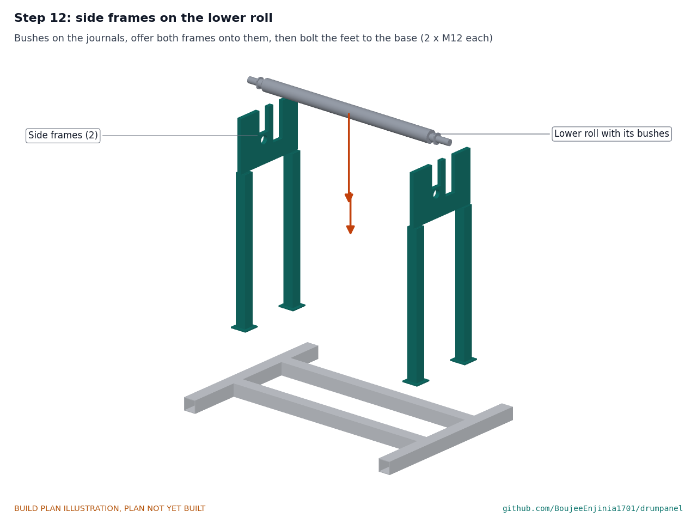

Fit the bushes on the lower roll's journals. Two people: offer both side frames onto the bushes, stand them on the base, and bolt each foot with two M12 bolts.

### Step 13: upper and bending rolls into the slots

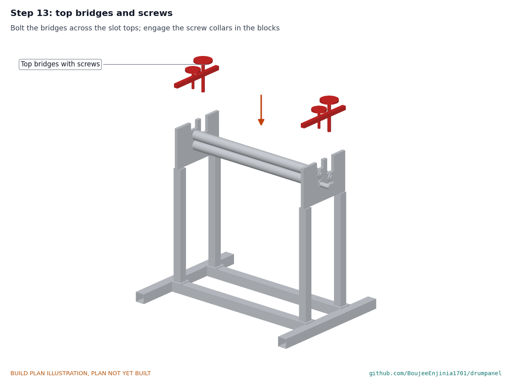

Fit the slide blocks and bushes on each roll's journals and lower the roll down its pair of slots. Fit the keeper plates on the inside faces.

### Step 14: top bridges, screws and dials

Bolt the bridges across the slot tops and run the screws down until their collars engage the blocks. Set the pinch with a strip of 1 mm sheet between the pinch rolls. On each bending screw, run the lock nut down to the bridge, clamp the dial above it, and screw the pointer to the bridge. Set both bending screws to the same dial reading at the nominal height, 13.4 mm above the lower roll, and lock them.

### Step 15: pinch gears

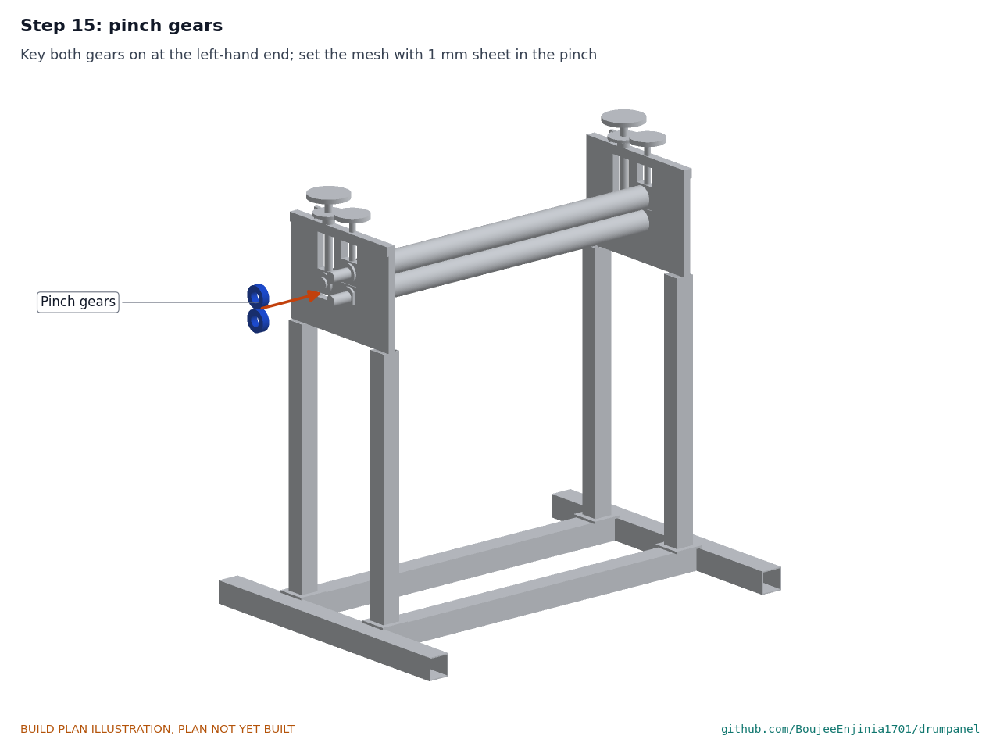

Key both gears on at the left-hand end and set their mesh with the 1 mm strip in the pinch.

### Step 16: crank, sprockets and chain


Bolt the crank bracket to the right-hand side frame, key the sprockets on, line them up, and fit the chain with about 5 mm of slack.

### Step 17: guards


Screw on the nip guards, lid, chain guard and gear guard. Check the 8 mm slots over the tables.

### Step 18: in-feed and out-feed tables


Stand the tables at the front and back, tops level with the rolls, and fix the legs.

## 5. First checks

These are the checks a TRL 4 test report would record; this plan only lists them. Requirement numbers are those of DMP-REQ-001. None involves cutting a drum until S4 and S5 are passed.

*Table 2. First checks.*

| Check | Requirement | How | Pass when |
| --- | --- | --- | --- |
| Gas detector | R2 | Bump test with 50 % LEL gas; alarm set at 5 % LEL | Alarm sounds; reading within the maker's limits |
| Purge and check | R1, R2 | One accepted drum through fill, soak, drain and check | Reading below 5 % LEL at both bungs; no flame or heat used |
| Drain stand | R11 | Fill a drum on the stand; look for movement | The stand does not move or rock with a full drum |
| Heads off | R3, R6 | Time both heads off one drum; spring scale on the crank | Under 10 min; crank force 150 N or less |
| Notches | R6 | Punch the two chime notches and the two hoop slots on the same drum; spring scale on the punch lever | Clean notches, the shear head passes them; lever force 150 N or less |
| Slit | R4, R6 | Slit a purged drum; measure the cut line against a straight line | Deviation 5 mm or less; crank force 150 N or less; the crank turns without touching the drum |
| Ring and hoop cuts | R6, R12 | Three passes with the ring head bolted on; spring scale on the crank | Three panels about 233 x 1,800 mm; crank force 150 N or less |
| Trial setting | R5 | First panel of the batch through the slip roll, adjusting the bending roll by its dials | Flat within 10 mm over 1 m after the passes; the dial reading and the number of passes recorded; a second drum set to that reading comes out flat |
| Slip roll effort | R6 | Spring scale on the crank with three panels | 150 N or less |
| Guards | R10 | A competent person checks every guard opening against ISO 13857 as built | Every opening meets the standard |
| Throughput | R7 | Half-day trial by two people, each task timed and written down by station | Drums per hour recorded against the estimate of 2.26 and the target of 2.5; this result decides R7 (DMP-DDR-004); no step is hurried or skipped to meet it |
| Parts cost | R9 | Sum the receipts | Recorded against the value-engineering target |

## 6. Safety stops

Stop at each point. Carry on only when everything listed is true.

- **S1. Before any making.** No drum anywhere near the workshop; welding area ventilated; fire extinguisher at hand; welding helmet, leather gloves and apron, safety glasses and hearing protection in use.
- **S2. Before any lift over 25 kg** (cradle frame 34 kg). Two people, clear floor.
- **S3. Before a drum is accepted.** Its label shows a non-volatile oil (flash point above 60 °C). Otherwise it is rejected and goes back to the supplier.
- **S4. Before a drum goes onto the cradle.** It has been purged and has passed the vapour check below 5 % LEL at both bungs that day, with a bump-tested detector. No grinder, torch or welder is used on it at any time.
- **S5. Before any crank is turned.** Every guard is fitted, the shear head's drive case closed; one person on the crank; nobody else's hands near the discs, the end cutter or the rolls; cut-resistant gloves and safety glasses on.
- **S6. Before the drum is slit.** The brake is on and the index pin is in at the slit position; the four notches are punched and the notching punch is back on its shelf.
- **S7. Before the ring cuts.** The brake is off, the head is swivelled and the index pin is in at the ring position; the ring head is bolted on with all four spacer plate bolts tight and the coupling in its guard sleeve.
- **S8. Before panels are handled or stacked.** Every cut edge is deburred.
- **S9. Purge water.** Settled and skimmed; oil kept in a closed container for a recycler; nothing poured on the ground.
- **S10. While notching.** Hands only on the ratchet lever; nobody holds the drum or the punch near the jaws while the screw is turned.

## 7. Tools, skills and workspace

**Tools.** Metal bandsaw or abrasive chop saw; angle grinder with cut-off and flap discs (never on a drum); pillar drill to 31 mm with drills 5 to 31 mm and a 57 mm hole saw or boring bar; stick welder of about 160 A for 3.2 mm E6013; welding table, clamps and magnetic squares; a lathe with at least 1.1 m between centres for the rolls and shafts (or a machine shop); taps M5 to M20 and M20 x 1.5; spanners and a torque wrench; tape, steel rule, callipers, engineer's square, spirit level, straightedge 1 m, feeler gauges.

**Skills.** A competent stick welder for the frames, posts and shear heads; a lathe operator for the rolls, shafts, bushes and dials; a tool shop for the punches and dies and their hardening; ordinary shop skill for the rest. A person trained to use and bump-test the gas detector.

**Workspace.** A covered, level concrete floor about 5 x 4 m for the three stations; a separate ventilated welding and grinding area with no drums in it; a drained spot for the drain stand with room for the settling drum.

**Personal protective equipment.** Welding helmet, leather gloves and apron; safety glasses for all cutting, drilling and grinding; hearing protection; safety boots for lifts; cut-resistant gloves for any work with cut drum steel; nitrile gloves for drum residue.

## 8. Where the numbers come from

- Model and constructability checks: `cad/src/model.py` (`python cad/src/model.py --check`); STEP and STL exports in `cad/step/` and `cad/stl/`.
- Pictures: `cad/src/build_plan_media.py`, using `.kit/build_views.py`; written to `docs/05-build-plan/` and `cad/drawings/DMP-DWG-101` to `DMP-DWG-123`.
- General arrangement: `cad/drawings/DMP-DWG-001.pdf`, Rev P2.
- Calculations: `docs/04-calcs/01-sizing.md` (DMP-CAL-001 v0.2) and `docs/04-calcs/sizing.py`.
- Bill of materials: `bom/bom.csv`.
- Decisions: `docs/decisions/0001-trl2-review-decisions.md` (DMP-DDR-001), `docs/decisions/0002-design-for-construction.md` (DMP-DDR-002) and `docs/decisions/0003-requirement-decisions-2026-10-03.md` (DMP-DDR-003).
- Requirements: `docs/03-requirements.md` (DMP-REQ-001 v0.4).
- Design decisions register: `docs/06-design-decisions.md` (DMP-DEC-001 v0.2).
